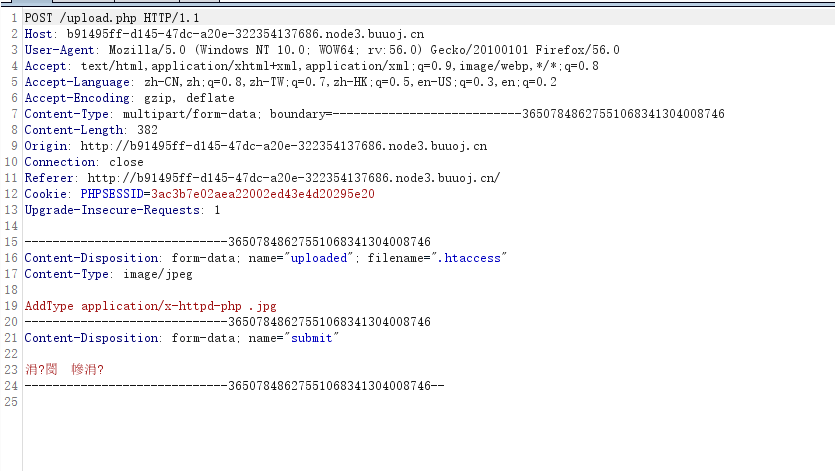

# \[RoarCTF 2019]Easy Java

## \[RoarCTF 2019]Easy Java

## 考点

* tomcat结构
* java ee结构

## wp

进去之后，没找到注册，就点一下 help

可以看到这样的页面，不难想到这是文件下载，但是 GET 请求什么都下不了，这时候不妨试一试 POST 请求

一般java web的配置文件目录是  WEB-INF/web.xml 可以尝试下载这个文件，然后可以找到 flag 目录，再尝试去下载 flag

下载 FlagController.class 丢到 IDEA 看一下，base64 解码一下即可

## 小结

1. tomcat 的文件结构，主要的是 /conf 和 /webapps
2. /conf 存放全局配置文件，最重要的是 server.xml 和 web.xml
3. /webapps  web发布目录，默认情况下把Web应用文件放于此目录
4. tomcat app 固有的结构 /app ，在 /webapps 下一级
5. /app/WEB-INF/web.xml : 存放web应用的发布描述文件web.xml
6. /app/WEB-INF/classes : 存放各种class文件，Servlet类文件也放于此目录
7. /app/WEB-INF/lib : 存放web应用所需的各种JAR文件
