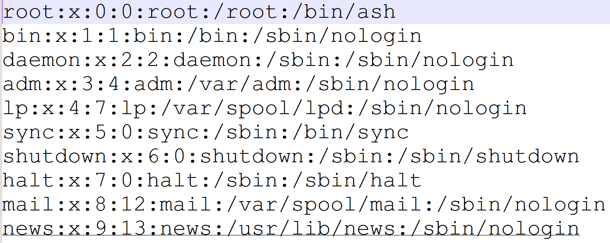

# \[GKCTF 2021]easycms

## \[GKCTF 2021]easycms

## 考点

* 代码审计

## wp

后台admin.php，账号密码admin/admin，admin/12345，demo/demo可以成功进入后台

### 第一种做法

在设计->主题中选择一个主题，选择自定义然后导出，可以看到下载地址

```
http://bfb8744f-271d-4917-a708-43b4db7339a8.node4.buuoj.cn:81/admin.php?m=ui&f=downloadtheme&theme=L3Zhci93d3cvaHRtbC9zeXN0ZW0vdG1wL3RoZW1lL2RlZmF1bHQvMS56aXA=
```

把后面的base64解码，得到/var/www/html/system/tmp/theme/default/1.zip

换个目录导出/etc/passwd->L2V0Yy9wYXNzd2Q=



再读取/flag->L2ZsYWc=即可

### 第二种方法

在设计->高级处修改代码，提示/var/www/html/system/tmp/orlp.txt要存在

然后在设计->组件->素材库上传文件，要上传一个txt文件，刷新再重命名为../../../../../system/tmp/orlp，最后再到设计->高级处写PHP代码即可

## 小结

* cms代码审计
