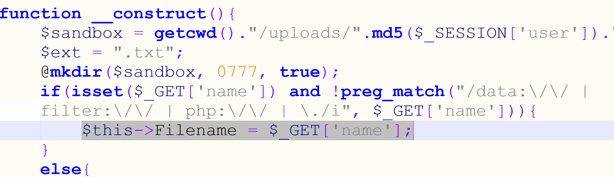
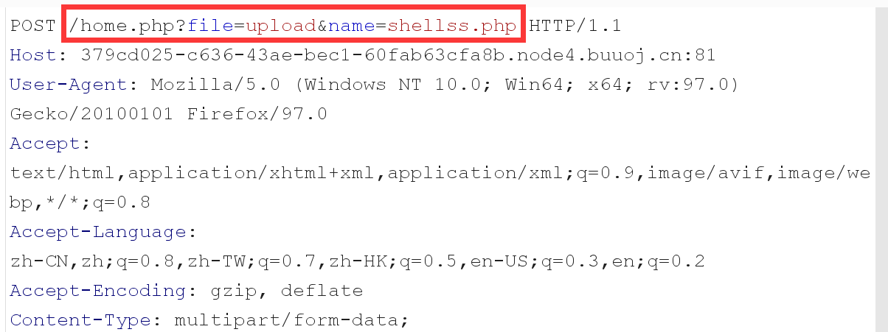
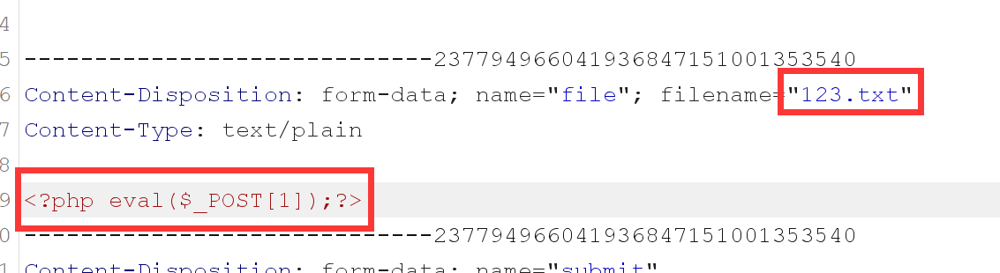
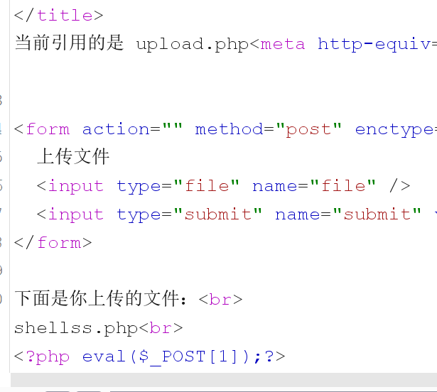

# \[GXYCTF2019]BabysqliV3.0

## \[GXYCTF2019]BabysqliV3.0

## 考点

* 弱口令admin/password
* 文件包含配合伪协议读取文件
* PHP代码审计

## wp

账号是admin，弱口令试出来密码是password

进去之后是个文件上传，URL是http://379cd025-c636-43ae-bec1-60fab63cfa8b.node4.buuoj.cn:81/home.php?file=upload

试试文件读取home.php?file=php://filter/read=convert.base64-encode/resource=home

只能获取home和upload结尾的文件

home.php

```php
<?php
session_start();
echo "<meta http-equiv=\"Content-Type\" content=\"text/html; charset=utf-8\" /> <title>Home</title>";
error_reporting(0);
if(isset($_SESSION['user'])){
	if(isset($_GET['file'])){
		if(preg_match("/.?f.?l.?a.?g.?/i", $_GET['file'])){
			die("hacker!");
		}
		else{
			if(preg_match("/home$/i", $_GET['file']) or preg_match("/upload$/i", $_GET['file'])){
				$file = $_GET['file'].".php";
			}
			else{
				$file = $_GET['file'].".fxxkyou!";
			}
			echo "当前引用的是 ".$file;
			require $file;
		}
		
	}
	else{
		die("no permission!");
	}
}
?>
```

upload.php

```php
<meta http-equiv="Content-Type" content="text/html; charset=utf-8" /> 

<form action="" method="post" enctype="multipart/form-data">
	上传文件
	<input type="file" name="file" />
	<input type="submit" name="submit" value="上传" />
</form>

<?php
error_reporting(0);
class Uploader{
	public $Filename;
	public $cmd;
	public $token;
	

	function __construct(){
		$sandbox = getcwd()."/uploads/".md5($_SESSION['user'])."/";
		$ext = ".txt";
		@mkdir($sandbox, 0777, true);
		if(isset($_GET['name']) and !preg_match("/data:\/\/ | filter:\/\/ | php:\/\/ | \./i", $_GET['name'])){
			$this->Filename = $_GET['name'];
		}
		else{
			$this->Filename = $sandbox.$_SESSION['user'].$ext;
		}

		$this->cmd = "echo '<br><br>Master, I want to study rizhan!<br><br>';";
		$this->token = $_SESSION['user'];
	}

	function upload($file){
		global $sandbox;
		global $ext;

		if(preg_match("[^a-z0-9]", $this->Filename)){
			$this->cmd = "die('illegal filename!');";
		}
		else{
			if($file['size'] > 1024){
				$this->cmd = "die('you are too big (′▽`〃)');";
			}
			else{
				$this->cmd = "move_uploaded_file('".$file['tmp_name']."', '" . $this->Filename . "');";
			}
		}
	}

	function __toString(){
		global $sandbox;
		global $ext;
		// return $sandbox.$this->Filename.$ext;
		return $this->Filename;
	}

	function __destruct(){
		if($this->token != $_SESSION['user']){
			$this->cmd = "die('check token falied!');";
		}
		eval($this->cmd);
	}
}

if(isset($_FILES['file'])) {
	$uploader = new Uploader();
	$uploader->upload($_FILES["file"]);
	if(@file_get_contents($uploader)){
		echo "下面是你上传的文件：<br>".$uploader."<br>";
		echo file_get_contents($uploader);
	}
}

?>
```

在上传这里文件名是完全可控的，并且没有对文件内容进行检测，那就可以直接传shell进去了



用burp抓一下包，加个name参数





在bp里面抓包改包send两次就可以了，send两次是为了看返回的位置，实际上send一次就可以了，没有返回是因为file\_get\_contents那里报错。



## 小结

1. 代码审计要理清代码的逻辑
