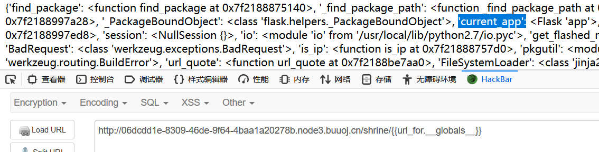
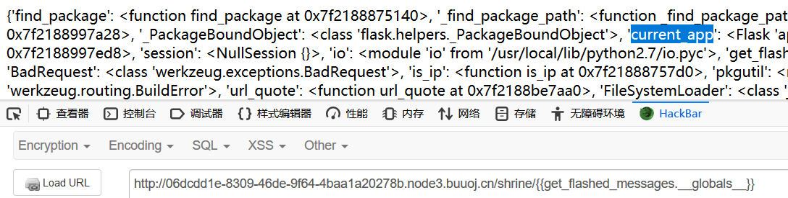

# \[WesternCTF2018]shrine

## \[WesternCTF2018]shrine <a href="#2975378401" id="2975378401"></a>

## 考点

* Flask SSTI获取config信息
* Flask SSTI bypass

## wp

直接给了代码

```python
import flask 
import os 

app = flask.Flask(__name__) 
app.config['FLAG'] = os.environ.pop('FLAG') 
@app.route('/') 
def index(): 
	return open(__file__).read() 
	
@app.route('/shrine/') 
def shrine(shrine): 
	def safe_jinja(s): 
        s = s.replace('(', '').replace(')', '') 
		blacklist = ['config', 'self'] 
        return ''.join(['{<div data-gb-custom-block data-tag="set"></div>}'.format(c) for c in blacklist]) + s 

	return flask.render_template_string(safe_jinja(shrine)) 

if __name__ == '__main__': 
	app.run(debug=True)
```

访问 `/shrine/` 是 404，访问 `/shrine/{{7*7}}` 可以发现存在 SSTI 漏洞，在代码中过滤了 `(, ), config, self` ，并且说明了 `flag` 在 `config` 中，可以读取 `app.config['FLAG']` 或者 `os.environ.pop('FLAG')`

这里的黑名单就锁死了 `__subclasses__()` 以及 `config` 和 `self.__dict__`

在 flask 的官方文档中写了一个 [url\_for](https://flask.palletsprojects.com/en/1.0.x/api/#flask.url\_forbaobaoer.cn/archives/656/python-b2e7b180e9b880e793) 函数，在它引用的内容中，有着 `current_app` 的全局变量，然后就可以直接读取 flag 了 `url_for.__globals__['current_app'].config['FLAG']`



同样的，还有一个 [get\_flashed\_messages](https://flask.palletsprojects.com/en/1.0.x/api/#flask.get\_flashed\_messages) 函数



## 小结

1. Flask SSTI获取config除了`{{config}}`，还有`{{url_for.__globals__['current_app'].config['FLAG']}}`和`{{get_flashed_messages.__globals__['current_app'].config['FLAG']}}`
