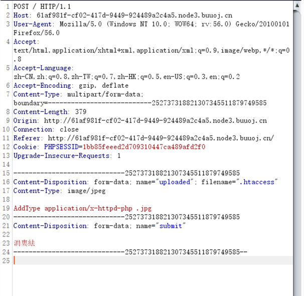

# \[GXYCTF2019]BabyUpload

## \[GXYCTF2019]BabyUpload

## 考点

* 文件上传.htaccess
* Content-Type绕过限制

## wp

随便传一个图片，给了上传的地址

上传php文件，提示后缀名不能有ph，基本排除解析漏洞

直接上传.htaccess失败，把`Content-Type`改成`image/jpeg`就上传成功了。

再上传图片马即可。

